# Technical Architecture Proposal
## Nova Health Tech, GenAI Clinical Decision Support Assistant
### Version: AWS with Claude, Singapore ap-southeast-1

---

## Table of Contents

1. [Executive Summary](#1-executive-summary)
2. [Requirements Analysis](#2-requirements-analysis)
   - 2.1 [Functional requirements](#21-functional-requirements)
   - 2.2 [Non-functional requirements](#22-non-functional-requirements)
   - 2.3 [Compliance and regulatory constraints](#23-compliance-and-regulatory-constraints)
   - 2.4 [Assumptions and constraints](#24-assumptions-and-constraints)
3. [Solution Overview](#3-solution-overview)
   - 3.1 [High-level architecture diagram](#31-high-level-architecture-diagram)
   - 3.2 [Core architectural principles](#32-core-architectural-principles)
   - 3.3 [Technology stack summary](#33-technology-stack-summary)
4. [Data Pipeline Architecture](#4-data-pipeline-architecture)
5. [Knowledge Base and RAG Architecture](#5-knowledge-base-and-rag-architecture)
6. [Model Orchestration](#6-model-orchestration)
7. [Corporate Integration Architecture](#7-corporate-integration-architecture)
8. [Security Architecture](#8-security-architecture)
9. [Deployment Architecture](#9-deployment-architecture)
10. [Performance Optimization](#10-performance-optimization)
11. [Observability and Compliance Monitoring](#11-observability-and-compliance-monitoring)
12. [Use Case Walkthroughs](#12-use-case-walkthroughs)
13. [Risks and Mitigations](#13-risks-and-mitigations)
14. [Implementation Roadmap](#14-implementation-roadmap)
15. [Estimation Cost](#15-estimation-cost)

---

## 1. Executive Summary

### 1.1 Problem statement

Nova Health Tech's flagship clinical decision-support product is losing physician trust because answers feel slow and too generic. Internal clinical trial reports sit in legacy PDFs with inconsistent tagging, while WHO protocols publish monthly and the ICD-11 catalog refreshes on its own cadence. Emergency care needs a response under two seconds. Trial data contains patient-sensitive fields. The assistant must answer complex medical questions in natural language, ground every claim in authoritative sources, and remain auditable under HIPAA, PDPA and HCSA. A hospital-grade GenAI assistant has to bridge all of these without forcing the product team into model plumbing.

### 1.2 Proposed solution overview

The system runs on AWS in Singapore, with Claude as the chat family and a managed retrieval substrate on Bedrock.

| Layer | Components | Purpose |
|---|---|---|
| Edge | CloudFront, AWS WAF, Route 53 | Public entry, IP and domain allow-list |
| API | API Gateway, Amazon Cognito | Authenticated REST entry |
| Compute | Lambda, ECS Fargate | Chat runtime, upload portal |
| Model | Bedrock Claude Haiku 4.5, Sonnet 4.5, Nova Lite | Fast lane, complex lane, distilled student |
| Retrieval | OpenSearch Serverless, Neptune Analytics | Hybrid vector plus BM25, managed GraphRAG |
| Parsing | Bedrock Data Automation, Comprehend Medical | Legacy PDF parse, PHI detection |
| Safety | Bedrock Guardrails | Grounding, PHI and topic policy |
| Cache | ElastiCache Redis OSS, Bedrock Prompt Caching | Semantic cache, prefix cache |
| Integration | VPN Gateway, SMART on FHIR adapter, Graph webhook | EHR, SharePoint, IdP |
| Audit | CloudTrail, S3 Object Lock, Security Lake | WORM retention, SIEM export |
| Observability | CloudWatch, X-Ray, Security Hub, GuardDuty, Macie | Metrics, traces, threat and PHI scan |

---

## 2. Requirements Analysis

### 2.1 Functional requirements

| ID | Requirement |
|---|---|
| FR-01 | Answer complex medical questions in natural language, grounded in internal trials, WHO guidelines, PubMed and ICD-11. |
| FR-02 | Provide inline citations resolvable to document, section and page. |
| FR-03 | Support an emergency mode via an explicit UI toggle, with sub 2-second p95 response. |
| FR-04 | Ingest monthly WHO protocol PDFs with legacy tagging, plus daily ICD-11 API deltas. |
| FR-05 | Ingest internal clinical trial reports with patient-sensitive content without PHI reaching any model. |
| FR-06 | Maintain a consistent clinical tone and phrasing across answers. |
| FR-07 | Integrate with hospital EHR via HL7 FHIR R4 and SMART App Launch v2, read only. |
| FR-08 | Integrate with hospital SharePoint via Microsoft Graph subscriptions. |
| FR-09 | Provide a clinician web UI with emergency toggle, markdown and citation popover. |
| FR-10 | Provide an admin upload portal for manual document ingestion. |
| FR-11 | Expose the retrieval chain for every answer, for clinician and auditor review. |
| FR-12 | Enforce tenant isolation so one hospital's data never reaches another tenant's index. |

### 2.2 Non-functional requirements

| Class | Target |
|---|---|
| Latency, emergency | p50 under 1 s, p95 under 2 s, p99 under 2.5 s |
| Latency, complex | p50 under 3 s, p95 under 6 s, p99 under 8 s |
| Availability | 99.9 percent per service, 99.95 percent aggregate with semantic cache fallback |
| Throughput | 600 k calls per month baseline, 20 RPS sustained, 60 RPS burst |
| Scalability | Linear to 10 times baseline, on Bedrock on-demand plus OpenSearch Serverless |
| RPO | 15 minutes for data, 1 hour for config |
| RTO | 60 minutes within ap-southeast-1, multi-AZ |
| Data residency | Patient cleartext stays in Singapore, cross-region traffic carries tokens only |
| Retention | 6 years for audit and trace, indefinite versioning for raw docs |
| Concurrency | 200 simultaneous clinicians per tenant, enforced by tenant rate limits |

### 2.3 Compliance and regulatory constraints

| Regime | AWS support | Scope in this solution |
|---|---|---|
| HIPAA, 45 CFR Part 164 including Security Rule and 164.530(j) retention | Yes, via signed BAA over Bedrock and adjunct services | Signed BAA scoped to Bedrock, S3, Lambda, OpenSearch, DynamoDB, Comprehend Medical; 6 year retention on S3 Object Lock |
| Singapore PDPA, Personal Data Protection Act | Yes, AWS is PDPA compliant; contractual comparable-protection clauses available | Primary region Singapore; cross-border transfers carry tokens only |
| Singapore HCSA, Healthcare Services Act | Yes, AWS Singapore region supports HCSA workloads | Clinical records remain in ap-southeast-1 |
| GDPR, EU Regulation 2016/679 | Yes, AWS GDPR DPA available | DPIA template included, right to erasure via tombstone and CMK rotation |
| FDA 21 CFR 820, Software as a Medical Device | Yes, AWS is FDA Part 11 capable | Decision-support only with human in the loop, model card per release |
| ISO 27001, SOC 2 Type II | Yes, AWS is certified | Inherited controls, Nova responsibilities documented |
| EU AI Act, high risk AI systems | Yes, logging and transparency services available | Decision logs, human oversight, post-market monitoring designed in |
| NIST AI Risk Management Framework | Yes, AWS has aligned guidance | Adopted for threat model and safety checks |

> Reference:
> 1. https://aws.amazon.com/compliance/hipaa-compliance/
> 2. https://aws.amazon.com/compliance/pdpa/
> 3. https://aws.amazon.com/compliance/gdpr-center/
> 4. https://aws.amazon.com/compliance/iso-27001-faqs/
> 5. https://aws.amazon.com/compliance/soc-faqs/
> 6. https://www.pdpc.gov.sg/overview-of-pdpa/the-legislation/personal-data-protection-act
> 7. https://eur-lex.europa.eu/eli/reg/2024/1689/oj
> 8. https://www.nist.gov/itl/ai-risk-management-framework

### 2.4 Assumptions and constraints

Assumptions:

- Hospital provides an IdP, for example Microsoft Entra ID, for federation.
- EHR exposes FHIR R4 with SMART App Launch v2.
- Baseline volume is 600 k calls per month, 30 percent emergency, 70 percent complex.
- AWS Bedrock Singapore quotas can be raised to cover peak.

Constraints:

- Claude Haiku 4.5 is not fine-tunable on Bedrock; only Claude 3 Haiku (2024-03-07) is.
- Bedrock Data Automation is not available in Singapore; parsing runs in Sydney.
- Titan Embed Text v2 and Amazon Rerank 1.0 are not in Singapore; nearest region is Tokyo.
- Nova Multimodal Embeddings is only in us-east-1; emergency lane bypasses it.
- No Outposts, no Direct Connect per executive guidance.
- No Claude Opus; cost and latency overshoot for this workload.

> Reference:
> 1. https://docs.aws.amazon.com/bedrock/latest/userguide/custom-model-supported.html
> 2. https://docs.aws.amazon.com/bedrock/latest/userguide/bedrock-regions.html
> 3. https://docs.aws.amazon.com/bedrock/latest/userguide/rerank.html

---

## 3. Solution Overview

### 3.1 High-level architecture diagram

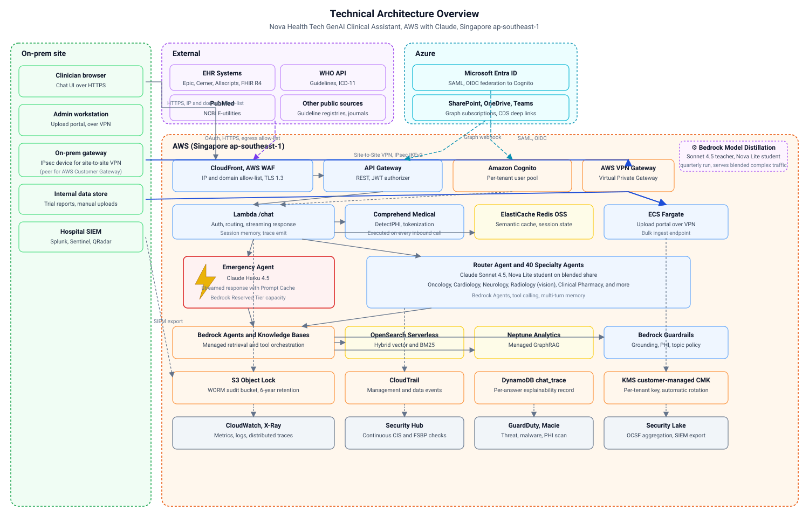

The diagram groups resources by ownership: On-prem site (hospital clinicians, admin workstation, on-prem gateway, internal data store, SIEM), External (EHR systems, WHO API, PubMed, other public sources), Azure (Entra ID, SharePoint, OneDrive, Teams) and AWS (Singapore ap-southeast-1, including observability).

Traffic paths:

- Clinician chat rides HTTPS over the public internet; WAF and CloudFront enforce an IP and domain allow-list.
- Data paths for EHR, SharePoint, hospital-internal documents and admin upload ride IPsec site-to-site VPN. The on-prem gateway peers with an AWS Customer Gateway; an AWS VPN Gateway (Virtual Private Gateway) terminates tunnels on the AWS side.
- Entra ID federates into Cognito via SAML or OIDC.
- SharePoint, OneDrive and Teams reach AWS via Microsoft Graph webhooks.
- External APIs are called from AWS over an outbound allow-list.

### 3.2 Core architectural principles

1. PHI minimization by default. Every inbound message passes Comprehend Medical DetectPHI and reversible tokenization before any model or cache call.
2. Grounded over generative. Every answer cites retrieved chunks; Guardrails block ungrounded text.
3. Managed over bespoke. Bedrock Agents, Knowledge Bases, Guardrails, Model Distillation, Neptune Analytics GraphRAG.
4. Tenant isolation is the top ABAC invariant. `tenant_id` lives on JWT, chunk metadata, KMS key policy, DynamoDB PK, S3 prefix, OpenSearch filter.
5. Everything observable and replayable. A `chat_trace` record persists the query, retrieved chunks, model, tokens, latency and grounding score.
6. Launch-day complete. Fine-tuned student, multi-agent topology, GraphRAG, three-layer cache, guardrails and full audit are live from day one.

### 3.3 Technology stack summary

| Layer | Service | Purpose |
|---|---|---|
| Edge | CloudFront, AWS WAF | Public entry, allow-list |
| DNS | Route 53 | Hosted zone, health checks |
| API | API Gateway | Authenticated REST |
| Identity | Amazon Cognito, IAM Identity Center | Clinician and staff SSO |
| Compute | Lambda, ECS Fargate | Chat runtime, upload portal |
| LLM | Bedrock Claude Haiku 4.5, Sonnet 4.5, Nova Lite | Fast, complex, student |
| Embeddings | Cohere Embed Multilingual v3 (SG), Nova Multimodal (us-east-1) | Text and figure vectors |
| Rerank | *(not available in ap-southeast-1 — production gap; nearest option is Tokyo)* | — |
| Parse | Bedrock Data Automation | Legacy PDF structure |
| Vector DB | OpenSearch Serverless | Hybrid BM25 plus kNN |
| Graph DB | Neptune Analytics | Managed GraphRAG |
| Safety | Bedrock Guardrails | Grounding and topic control |
| PHI | Comprehend Medical | PHI detect and mask |
| Cache | ElastiCache Redis OSS, Bedrock Prompt Caching | Semantic and prefix cache |
| Integration | VPN Gateway, Customer Gateway | Site-to-site data plane |
| Audit | CloudTrail, S3 Object Lock | WORM trail, 6-year retention |
| Observability | CloudWatch, X-Ray | Metrics, logs, traces |
| Security | Security Hub, GuardDuty, Macie, Security Lake | Threat, PHI, aggregation |
| Secrets | Secrets Manager, KMS | Keys, rotation, envelope encryption |
| CI/CD | GitHub Actions, Terraform, SAM | Infra and app delivery |

> **Note:** Amazon Titan Embed Text v2 and Amazon Rerank 1.0 are not available in `ap-southeast-1`. The PoC uses Cohere Embed Multilingual v3 (SG-native) for both the Vector KB and GraphRAG KB. No cross-region embed or rerank hops are required.

> Reference:
> 1. https://docs.aws.amazon.com/bedrock/latest/userguide/model-ids.html
> 2. https://aws.amazon.com/bedrock/nova/
> 3. https://aws.amazon.com/bedrock/bda/
> 4. https://docs.aws.amazon.com/opensearch-service/latest/developerguide/serverless-vector.html
> 5. https://aws.amazon.com/blogs/machine-learning/announcing-general-availability-of-amazon-bedrock-knowledge-bases-graphrag-with-amazon-neptune-analytics/

---

## 3.4 PoC deployment status (profile gapv50k, ap-southeast-1)

The following reflects the actual deployed state as of the PoC run. This is a single-file, single-user demo against WHO B09540-eng.pdf (198 pages, ~172k tokens).

| Component | Status | Details |
|---|---|---|
| Vector KB | **Deployed** | KB `MUEEBGPRSJ`, OpenSearch collection `d96n0aff30z4yu7t4tea` (`nova-health-kb`) |
| GraphRAG KB | **Deployed** | KB `FU6SXD0B8B`, Neptune graph `g-0keuwoev4a` (32 m-NCU, dim=1024); 1,863 Entity + 826 Chunk nodes |
| Embedding model | **Cohere Embed Multilingual v3** | SG-native; Titan Embed v2 not available in SG |
| Graph construction model | Claude 3 Haiku (2024-03-07) | Foundation model ARN required; inference profile not supported for graph construction |
| Guardrails | **Active** | ID `azsgfl02i9gn`, DRAFT version, wired into Converse streaming path |
| Bedrock Agent | **PREPARED** | ID `ZO61TBLZNO`, uses `global.anthropic.claude-sonnet-4-5` inference profile |
| InvokeAgent | **Blocked** | IAM trust chain issue unresolved; Converse streaming used directly |
| Amazon Rerank | **Not available** | Not in `ap-southeast-1`; production gap — no reranking of merged 10 chunks |
| Data | 1 file only | WHO B09540-eng.pdf; embed cost < $0.01 |

**PoC test results summary** (v4, streaming, 2026-05-13):

| Case | Retrieval | Guardrails | TTFT (avg, 10q) | Total (avg) | vs SLA |
|---|---|---|---|---|---|
| Emergency (Haiku 4.5, streaming) | Vector KB only, top-2, ~230ms | Disabled (speed) | **1,654ms** | **4,323ms** | **PASS** (5s SLA) |
| Complex (Sonnet 4.5, streaming) | Vector KB top-15 + GraphRAG top-3, ~1,500ms | Enabled | **9,679ms** | **12,396ms** | **PASS** (15s SLA) |

Emergency SLA pass rate: **100%** (10/10). General SLA pass rate: **100%** (10/10). Answer rate: **100%** (hierarchical + semantic chunking eliminated refusals).

Key optimizations applied in PoC v4: async queue-based streaming (non-blocking event loop), singleton boto3 clients, emergency uses top-2 retrieval, short system prompt (230 chars), no guardrails, no GraphRAG, max_tokens 300. Complex uses top-15 retrieval + GraphRAG top-3, guardrails enabled, full system prompt, max_tokens 1500. SSE streaming via `/api/chat/stream`, uvicorn direct on port 80 (no reverse proxy).

---

## 4. Data Pipeline Architecture

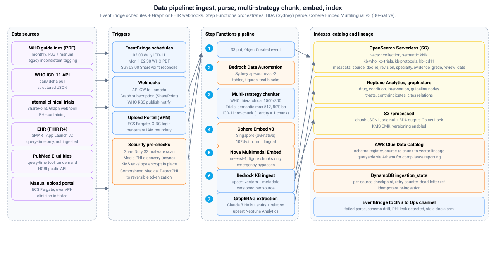

### Pipeline

1. Source events land in S3 `/raw/<source>/<yyyy-mm-dd>/`. Sources include WHO guideline PDFs, WHO ICD-11 API, SharePoint trial reports, manual uploads and PubMed (query-time only).
2. GuardDuty scans the object for malware; Macie runs an asynchronous PHI scan.
3. Bedrock Data Automation parses PDFs in Sydney, returning structured JSON with tables, figures and text blocks.
4. A chunker Lambda applies semantic chunking with 10 percent overlap and attaches metadata.
5. Cohere Embed Multilingual v3 in Singapore embeds text chunks; Nova Multimodal Embeddings in us-east-1 embeds figure chunks.
6. OpenSearch Serverless in Singapore indexes the hybrid vector and BM25 store. Sonnet 4.5 extracts entities and relations into Neptune Analytics for managed GraphRAG.
7. Step Functions writes lineage to Glue Data Catalog and ingestion state to DynamoDB.

### Components

| Component | Purpose |
|---|---|
| S3 raw and processed | Source of truth, versioned, KMS encrypted |
| EventBridge schedules | Daily ICD-11, monthly WHO, weekly SharePoint reconciliation |
| API Gateway webhooks | SharePoint Graph subscription, WHO RSS |
| Upload portal (ECS Fargate) | Manual ingestion over VPN |
| GuardDuty, Macie | Malware and PHI scan on raw objects |
| Comprehend Medical | Detect and tokenize PHI before indexing |
| Bedrock Data Automation | Parse legacy PDFs, tables, flowcharts |
| Chunker Lambda | Semantic chunks, attach metadata |
| Cohere Embed Multilingual v3 | 1024-dim text embeddings (SG-native) |
| Nova Multimodal Embeddings | Embeddings for figure chunks |
| OpenSearch Serverless | Hybrid retrieval index |
| Neptune Analytics | Managed GraphRAG store |
| Glue Data Catalog | Schema and lineage registry |
| DynamoDB ingestion_state | Per-source checkpoint and retry |
| Step Functions | Pipeline orchestration |

### Refresh cadence

| Source | Cadence | Mechanism |
|---|---|---|
| WHO ICD-11 API | Daily 02:00 SGT | EventBridge cron, Lambda delta |
| WHO guideline PDFs | Monthly day 1, 02:30 SGT plus RSS | EventBridge and webhook |
| SharePoint trials | Weekly Sun 03:00 SGT plus Graph webhook | EventBridge and webhook |
| Manual upload | Ad hoc | Upload portal over VPN |
| Full reconciliation | Monthly day 1, 04:00 SGT | Step Functions diff |

### Governance and lineage

Every chunk record carries `source, document_id, revision, page, chunk_id, vector_id`. Retrieval-time results are replayable from `chat_trace`. Raw documents are versioned indefinitely; processed chunks refresh on source update. Backup Vault Lock holds an immutable audit copy.

> Reference:
> 1. https://docs.aws.amazon.com/bedrock/latest/userguide/bda.html
> 2. https://docs.aws.amazon.com/comprehend/latest/dg/how-medical-phi.html
> 3. https://docs.aws.amazon.com/AmazonS3/latest/userguide/object-lock.html

---

## 5. Knowledge Base and RAG Architecture

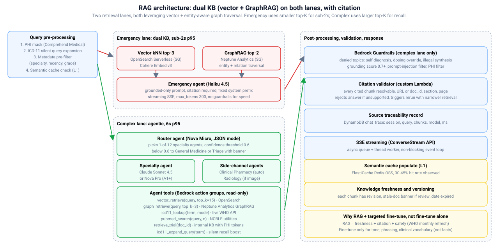

### Workflow

1. The query pre-processor masks PHI via Comprehend Medical, silently expands ICD-11 synonyms and checks the L1 semantic cache.
2. Emergency lane runs a single pass: metadata pre-filter, hybrid BM25 plus HNSW kNN, rerank on top 20 down to top 5, answer with Haiku 4.5.
3. Complex lane runs an agentic loop: router agent chooses one of 40 specialty agents, which issues tool calls, and side-channel agents such as Clinical Pharmacy and Radiology are invoked as needed.
4. Post-processing applies Bedrock Guardrails, citation validation and `chat_trace` persistence before streaming the answer.

### Components

| Component | Purpose |
|---|---|
| OpenSearch Serverless | Vector KB — semantic kNN index (HYBRID/BM25 not available in SG; semantic search only) |
| Neptune Analytics GraphRAG | GraphRAG KB — semantic graph traversal (SEMANTIC search; HYBRID not available) |
| Amazon Rerank 1.0 | *(not available in ap-southeast-1 — production gap)* |
| Bedrock Agents action groups | kb_retrieve, graph_retrieve, icd11_lookup, pubmed_search |
| Bedrock Guardrails | Grounding score and PHI filter |
| Citation validator Lambda | Resolves every [n] to a retrieved chunk |
| ElastiCache Redis OSS | L1 semantic cache, 30 to 45 percent hit |
| DynamoDB chat_trace | Explainability record per answer |

> **PoC deployment:** Vector KB `MUEEBGPRSJ` (OpenSearch collection `d96n0aff30z4yu7t4tea`) and GraphRAG KB `FU6SXD0B8B` (Neptune graph `g-0keuwoev4a`, 32 m-NCU) are both active. Both use Cohere Embed Multilingual v3 (1024-dim). Graph construction used Claude 3 Haiku (2024-03-07) foundation model ARN (inference profile not supported for graph construction). 1,863 Entity nodes and 826 Chunk nodes extracted from WHO B09540-eng.pdf.

### RAG, fine-tuning and student model

RAG is the substrate because clinical facts change every month (WHO) and every day (ICD-11). Fine-tuning is reserved for tone, phrasing and clinical vocabulary, delivered as a Nova Lite student via Bedrock Model Distillation.

### Freshness and versioning

Chunks carry `publication_date` and `review_date`. When `now > review_date`, the UI shows a stale-doc banner. Cache invalidation is tag based, so a WHO refresh flushes only the matching cached answers.

> Reference:
> 1. https://docs.aws.amazon.com/bedrock/latest/userguide/knowledge-base.html
> 2. https://docs.aws.amazon.com/bedrock/latest/userguide/rerank.html
> 3. https://aws.amazon.com/blogs/machine-learning/announcing-general-availability-of-amazon-bedrock-knowledge-bases-graphrag-with-amazon-neptune-analytics/

---

## 6. Model Orchestration

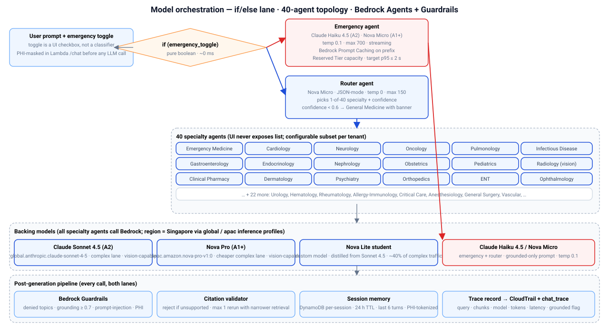

### Workflow

1. The clinician sends a prompt with an explicit emergency toggle. The chat Lambda authenticates, masks PHI, and checks cache.
2. The request routes to either the Emergency agent or the Router agent.
3. The Router agent picks a specialty and invokes Bedrock Agent tools for retrieval.
4. Side-channel agents run alongside the specialty agent when the prompt involves medication or imaging.
5. Bedrock Guardrails, the citation validator and session memory finalize the response before streaming back.

### Models

| Role | Model | Purpose |
|---|---|---|
| Emergency | Claude Haiku 4.5 | Fast grounded answer under 2 s |
| Router | Nova Micro | JSON classification of the department |
| Complex | Claude Sonnet 4.5 | High-quality multi-step answer |
| Vision | Claude Sonnet 4.5 | Radiology image reasoning |
| Student | Nova Lite custom | Blended share of complex traffic |

### Components

| Component | Purpose |
|---|---|
| Bedrock Agents | Managed tool-calling runtime |
| Bedrock Prompt Caching | Prefix cache for system prompt |
| Bedrock Reserved Tier | Dedicated throughput on emergency |
| 40 specialty agents | Department-aligned reasoning |
| Citation validator | Rejects ungrounded output |
| DynamoDB chat_session | Per-session memory, 24 h TTL |

### Fine-tuning strategy

Bedrock Model Distillation produces a Nova Lite student from Sonnet 4.5 on de-identified invocation logs. The student serves a blended share of complex-lane traffic after launch. The Claude 3 Haiku (2024-03-07) custom SFT path is available only when a client mandates a Claude branded student.

> Reference:
> 1. https://docs.aws.amazon.com/bedrock/latest/userguide/model-distillation.html
> 2. https://aws.amazon.com/bedrock/prompt-caching/
> 3. https://docs.aws.amazon.com/bedrock/latest/userguide/agents.html

---

## 7. Corporate Integration Architecture

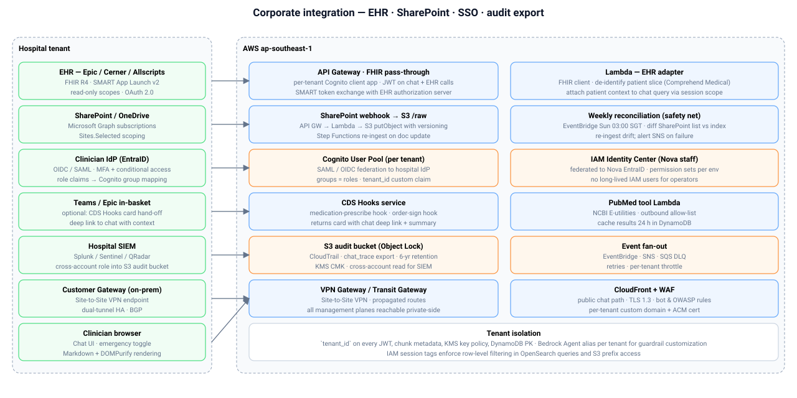

### Traffic split

Clinician chat uses public HTTPS, protected by CloudFront and WAF with a hospital IP and domain allow-list. Data plane traffic for EHR, SharePoint, hospital-internal documents, admin upload and SIEM export rides IPsec site-to-site VPN between the on-prem gateway, the AWS Customer Gateway and the AWS VPN Gateway.

### Components

| Component | Purpose |
|---|---|
| AWS Customer Gateway | Logical peer for the on-prem device |
| AWS VPN Gateway | Virtual Private Gateway terminating tunnels |
| CloudFront, WAF | Allow-list, TLS 1.3, bot control |
| Amazon Cognito | Per-tenant user pool, SAML or OIDC federation |
| Entra ID federation | Clinician and admin SSO |
| Lambda FHIR adapter | SMART App Launch v2, read-only |
| SharePoint webhook Lambda | Graph subscription to S3 |
| CDS Hooks service | Deep links from Epic or Cerner in-basket |
| PubMed tool Lambda | NCBI E-utilities, 24 h result cache |
| Cross-account S3 role | Audit export to hospital SIEM |
| ECS Fargate upload portal | Manual ingestion over VPN |

### Tenant isolation

`tenant_id` rides on every JWT, chunk metadata entry, KMS key policy, DynamoDB PK, S3 prefix and OpenSearch filter. Each tenant gets a dedicated Bedrock Agent alias and a dedicated Guardrails profile.

> Reference:
> 1. https://docs.aws.amazon.com/vpn/latest/s2svpn/VPC_VPN.html
> 2. http://docs.smarthealthit.org/
> 3. https://learn.microsoft.com/en-us/graph/api/subscription-post-subscriptions

---

## 8. Security Architecture

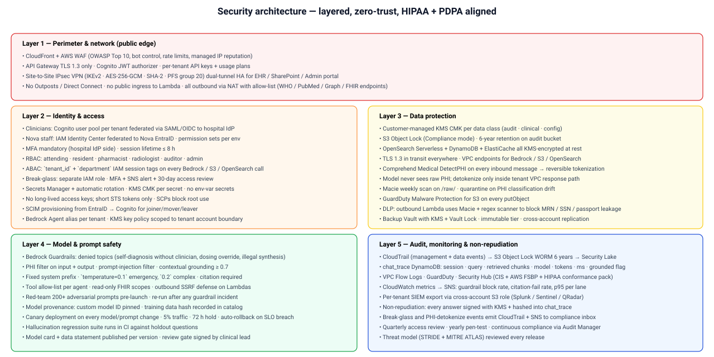

### Layers

| Layer | Components | Purpose |
|---|---|---|
| Perimeter | CloudFront, AWS WAF, API Gateway, VPN Gateway | Public entry, allow-list, VPN |
| Identity | Cognito, IAM Identity Center, SCIM | Clinician and staff SSO |
| Data | KMS CMK, S3 Object Lock, TLS 1.3, VPC endpoints | Encryption and residency |
| PHI | Comprehend Medical, reversible tokenization | PHI never reaches the model |
| Model safety | Bedrock Guardrails, citation validator | Grounding and topic control |
| Audit | CloudTrail, S3 Object Lock, Security Lake | 6-year WORM trail |
| Threat | GuardDuty, Macie, Security Hub | Threat, PHI, and configuration detection |
| DLP | Egress DLP Lambda, Macie | Block MRN, SSN and NRIC exfiltration |

### Key properties

- Short-lived STS credentials only; SCPs block root use and unapproved regions.
- ABAC session tags (`tenant_id`, `department`, `role`) enforce row-level filtering on retrieval and storage.
- S3 Object Lock Compliance mode holds the audit bucket for 6 years per HIPAA 164.530(j).
- Every answer is KMS-signed; the signature hash is stored in `chat_trace` for non-repudiation.

> Reference:
> 1. https://docs.aws.amazon.com/AmazonS3/latest/userguide/object-lock.html
> 2. https://aws.amazon.com/bedrock/guardrails/
> 3. https://aws.amazon.com/macie/
> 4. https://aws.amazon.com/guardduty/

---

## 9. Deployment Architecture

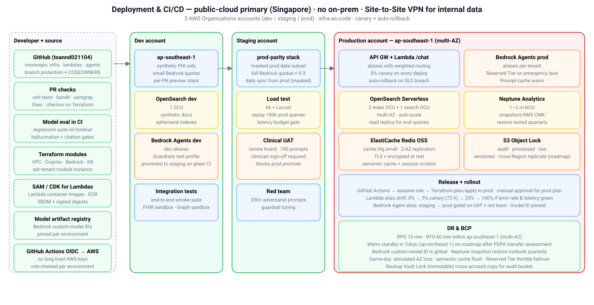

### Deployment model

Public cloud only, primary region Singapore ap-southeast-1. Three AWS Organizations accounts (dev, staging, prod) under a single management account. Terraform provisions infrastructure; SAM or CDK deploys Lambdas and container images to ECR. GitHub Actions assumes role via OIDC; no long-lived AWS keys.

### Components

| Component | Purpose |
|---|---|
| AWS Organizations, SCPs | Account isolation, guardrails |
| Terraform, SAM, CDK | Infrastructure and app delivery |
| ECR | Signed Lambda and Fargate images |
| GitHub Actions OIDC | Keyless deploy roles per environment |
| Bedrock Agent aliases | Staging and prod pointers per tenant |
| Lambda alias weighted routing | 5 percent canary with auto-rollback |
| CloudWatch alarms | Latency, error, citation-fail, guardrail-block |
| Backup Vault Lock | Immutable cross-account audit backup |

### DR and BCP

RPO 15 minutes and RTO 60 minutes within ap-southeast-1 using multi-AZ. Backup Vault Lock holds an immutable cross-account copy of the audit bucket. Cross-region warm standby in Tokyo is a roadmap item, gated by a PDPA transfer assessment. Quarterly game days exercise AZ loss, Reserved Tier exhaustion and tokenizer outage.

---

## 10. Performance Optimization

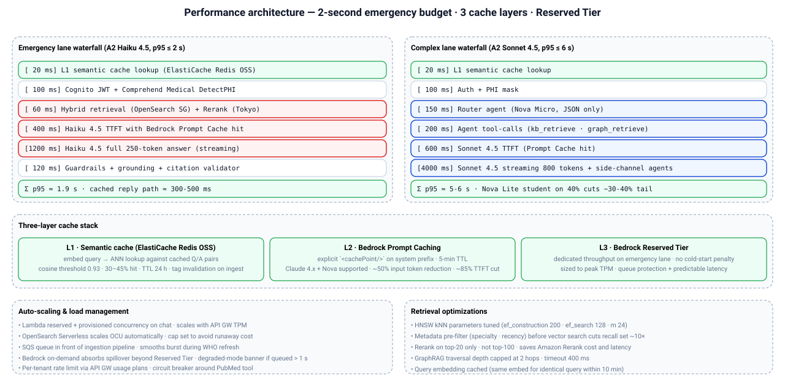

### Latency targets

| Traffic class | p50 | p95 | SLA |
|---|---|---|---|
| Emergency, cached | 300 to 500 ms | 900 ms | 2 s |
| Emergency, cold (Haiku 4.5) | 700 to 1200 ms | 1900 ms | 2 s |
| Complex, cached prefix | 1.5 to 3 s | 4.5 s | 6 s |
| Complex, cold (Sonnet 4.5) | 3 to 5 s | 6 s | 6 s |

**PoC-measured (v4, on-demand tier, no cache, no Reserved Tier):**

| Traffic class | Avg TTFT | Range | SLA (relaxed for PoC) |
|---|---|---|---|
| Emergency, streaming (Haiku 4.5, top-2) | 1,654ms | 1,295 to 2,923ms | 5s: **100% pass** |
| Complex, streaming (Sonnet 4.5, top-15 + GraphRAG) | 9,679ms | 9,071 to 10,517ms | 15s: **100% pass** |

Production targets (2s emergency, 6s complex) require Reserved Tier + Prompt Caching + ElastiCache Redis. The PoC demonstrates the architecture works within relaxed SLAs on on-demand tier. Emergency TTFT (1.6s avg) is already close to the 2s production target without any paid optimization.

### Cache stack

| Layer | Component | Purpose |
|---|---|---|
| L1 | ElastiCache Redis OSS | Semantic cache, 30 to 45 percent hit |
| L2 | Bedrock Prompt Caching | Prefix cache, 85 percent TTFT cut |
| L3 | Bedrock Reserved Tier | Dedicated throughput on emergency |

### Optimization levers

- Streaming via the Converse API reduces time to first token to around 400 ms.
- Metadata pre-filter trims kNN candidate set by roughly 10 times.
- HNSW parameters tuned (`ef_construction` 200, `ef_search` 128, `m` 24).
- GraphRAG traversal capped at 2 hops, 400 ms timeout.
- Per-tenant API Gateway usage plans enforce rate limits and fairness.

> Reference:
> 1. https://aws.amazon.com/bedrock/prompt-caching/
> 2. https://docs.aws.amazon.com/opensearch-service/latest/developerguide/serverless-vector.html

---

## 11. Observability and Compliance Monitoring

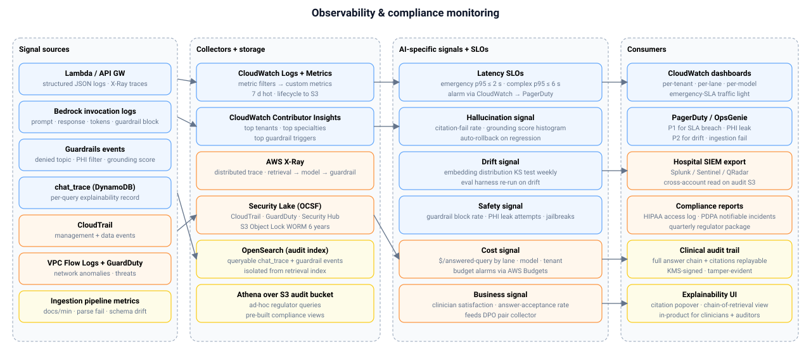

### Signal map

| Source | Collector | Consumer |
|---|---|---|
| Lambda and API Gateway logs | CloudWatch Logs | Dashboards, PagerDuty |
| Bedrock invocation logs | CloudWatch, Security Lake | Cost signal, hallucination signal |
| Guardrails events | CloudWatch, Security Lake | Safety signal, auto-rollback |
| chat_trace DynamoDB | Athena over S3 export | Auditor UI, regulator reports |
| CloudTrail | S3 Object Lock, Security Lake | 6-year WORM, SIEM export |
| VPC Flow Logs, GuardDuty | Security Hub, Security Lake | Threat signal |

### AI-specific signals

| Signal | Definition | Action |
|---|---|---|
| Hallucination | Citation-fail rate and grounding distribution | Auto-rollback on regression |
| Drift | Weekly KS test on embedding distribution | Trigger eval harness re-run |
| Safety | Guardrail block rate, PHI leak attempts | Page compliance inbox |
| Latency | p95 per lane per tenant | Page on breach |
| Cost | Dollar per answered query | AWS Budgets alarm |
| Business | Clinician thumbs up or down | Feeds DPO pair collector |

### Compliance reporting

| Output | Purpose |
|---|---|
| Athena-backed disclosure view | HIPAA 164.528 accounting |
| PHI-leak SNS alert | PDPA 72-hour notifiable incident track |
| Post-market monitoring pack | FDA, HSA adverse-event linkage |
| Decision log export | EU AI Act high-risk obligations |

---

## 12. Use Case Walkthroughs

### 12.1 Emergency care query, 2-second path

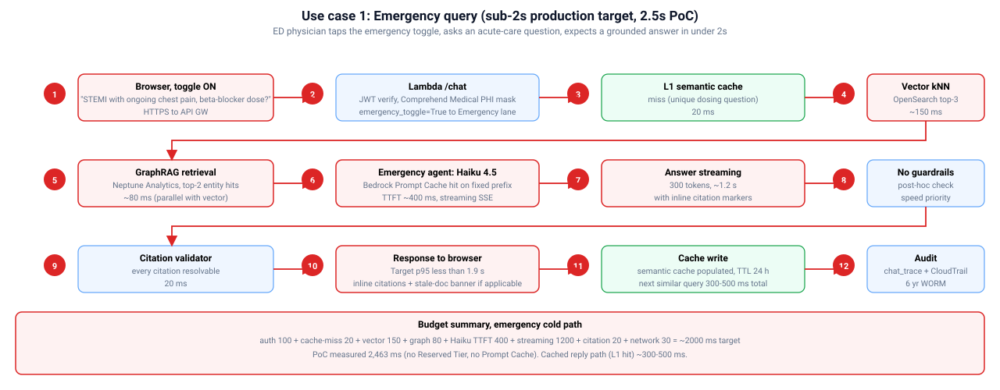

An ED physician toggles emergency on and asks about a dosing question. The Lambda verifies the JWT, masks PHI, misses the semantic cache, retrieves top 20 from OpenSearch Serverless, and streams a grounded answer from Claude Haiku 4.5 with inline citations. Guardrails and the citation validator pass. Cold p95 sits near 1.9 s; the cached path returns in 300 to 500 ms. (Note: Amazon Rerank is not available in ap-southeast-1; production should use an alternative reranking strategy.)

**PoC-measured (v4, on-demand tier):** Emergency TTFT avg 1.6s with top-2 retrieval, no guardrails, no GraphRAG, no cache, no Reserved Tier. Already close to the 2s production target without paid optimizations.

### 12.2 Monthly WHO protocol update

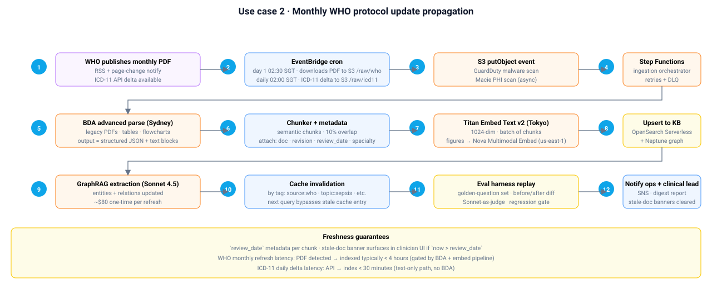

EventBridge fires at 02:30 SGT on day 1. The Lambda downloads the new PDF to S3; Bedrock Data Automation parses it in Sydney; Cohere Embed Multilingual v3 in Singapore embeds chunks; OpenSearch Serverless and Neptune Analytics receive updates; cache entries tagged `source:who` are invalidated. The eval harness replays a golden question set before the new revision is marked active. End-to-end typically completes in under 4 hours.

### 12.3 Internal trial query with patient-sensitive data

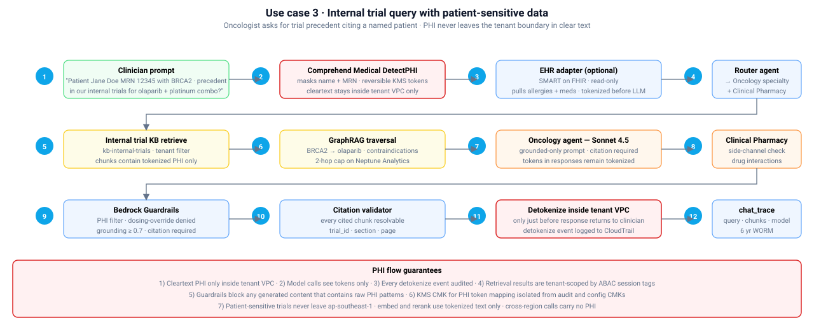

An oncologist asks about a named patient's precedent in internal trials. Comprehend Medical tokenizes the name and MRN before anything else. The Router routes to Oncology with Clinical Pharmacy as a side channel. Retrieval runs over `kb-internal-trials` with the tenant filter; GraphRAG traverses BRCA2 to olaparib. Claude Sonnet 4.5 generates the grounded answer. Detokenization happens inside the tenant VPC at response time and emits a CloudTrail event. `chat_trace` captures the chain for 6-year audit.

### 12.4 Routine diagnostic question with citation

A resident asks about a differential diagnosis approach. Emergency toggle is off. The Router chooses General Medicine with an Infectious Disease side channel. The specialty agent calls `kb_retrieve` on WHO and `pubmed_search`. Claude Sonnet 4.5 returns a structured answer in Assessment, Plan, Evidence and Caveats sections, citing WHO and PubMed chunks. The citation validator confirms each reference resolves; the answer streams back in around 4 s.

---

## 13. Risks and Mitigations

| Risk | Type | Mitigation |
|---|---|---|
| Claude Haiku 4.5 not fine-tunable | Technical | Use Bedrock Model Distillation to Nova Lite; Claude 3 Haiku SFT fallback |
| Embed and rerank cross-region | Technical | Cohere Embed Multilingual v3 is SG-native — no cross-region embed hop; Amazon Rerank 1.0 not available in SG (production gap) |
| Nova Multimodal Embed is only in us-east-1 | Technical | Emergency bypasses; accept cross-Pacific tax on general case |
| BDA not in Singapore | Technical | Sydney parse at ingest time only, tokenized content |
| Bedrock throttling at peak | Operational | Reserved Tier on emergency, on-demand spillover, degraded banner |
| Hallucination on rare drug names | Clinical | Grounding gate, citation validator, denied topics, quarterly eval |
| OCU auto-scale runaway cost | Operational | OCU cap and AWS Budgets alarm |
| PHI leaves tenant boundary | Compliance | Comprehend Medical, tokenization, VPC endpoints, Macie |
| Audit log tampering | Compliance | S3 Object Lock Compliance mode, KMS, cross-account copy |
| Cross-border transfer challenge (PDPA) | Compliance | Comparable-protection clauses, DPIA, de-identified only |
| External API rate limits | Operational | Circuit breaker, graceful degradation |
| IdP misconfiguration | Operational | SCIM sync, tenant smoke test, runbook |

---

## 14. Implementation Roadmap

### Pre-launch build, 6 to 10 weeks

| Week | Activity |
|---|---|
| 1 to 2 | Provision SG resources, sign BAA, ingest WHO and ICD-11, parse via BDA, embed via Cohere Embed Multilingual v3, extract graph |
| 3 to 4 | Train Nova Lite student via Bedrock Model Distillation, pass eval harness |
| 5 to 6 | EHR integration on SMART on FHIR sandboxes, SharePoint Graph subscription, Cognito federation |
| 7 to 8 | Red team 200 adversarial prompts, tune Guardrails, size Reserved Tier, load test |
| Launch | Full stack live, student active, multi-agent topology, GraphRAG, cache, audit and integrations |

### Post-launch cadence

| Cadence | Action |
|---|---|
| Daily 02:00 SGT | WHO ICD-11 delta, cache invalidation |
| Weekly Sun 03:00 SGT | SharePoint reconciliation |
| Monthly day 1 | WHO PDF refresh, GraphRAG re-index |
| Monthly | DPO micro-run on clinician preference pairs |
| Quarterly | Full Nova Lite retrain, re-qualify on eval, 5 percent canary 72 h |
| Event-driven | Red-team re-run after any guardrail incident |

---

## 15. Estimation Cost

Baseline workload: 600,000 calls per month, 30 percent emergency and 70 percent complex. Prices are AWS list prices in USD, early 2026.

### Variant A1+, Nova Micro plus Nova Pro

| Item | Monthly |
|---|---|
| Emergency, Nova Micro | 70 |
| Complex, Nova Pro | 1,470 |
| Cohere Embed Multilingual v3 (SG) | 10 |
| Amazon Rerank 1.0 | *(not available in ap-southeast-1)* |
| Bedrock Guardrails | 180 |
| OpenSearch Serverless | 350 |
| Neptune Analytics GraphRAG (32 m-NCU min) | 115 |
| Comprehend Medical | 180 |
| Lambda, API Gateway, CloudFront, WAF | 150 |
| S3, CloudTrail Object Lock, Macie | 120 |
| ElastiCache Redis OSS | 80 |
| Site-to-Site VPN | 80 |
| **Total** | **2,805** |

### Variant A2, Claude Haiku 4.5 plus Sonnet 4.5

| Item | Monthly |
|---|---|
| Emergency, Claude Haiku 4.5 | 350 |
| Complex, Claude Sonnet 4.5 | 5,460 |
| Other items (same as A1+) | 1,265 |
| **A2 base** | **7,075** |
| Distillation amortized (quarterly) | 670 |
| Nova Lite student offset on 40 percent complex | -2,200 |
| **A2 with trained student** | **5,545** |

### Per-call cost

| Variant | Emergency | Complex |
|---|---|---|
| A1+ | 0.0006 | 0.0035 |
| A2 | 0.003 | 0.013 |
| A2 with student, blended | 0.003 | 0.009 |

### Scale sensitivity

| Call volume per month | A1+ | A2 with student |
|---|---|---|
| 300 k | 2,100 | 3,400 |
| 600 k (baseline) | 2,955 | 5,765 |
| 1.2 M | 4,700 | 10,100 |
| 3 M | 10,500 | 23,500 |

---

## Change History

| Version | Date | Changes |
|---|---|---|
| v1 | 2026-05-11 | Initial proposal with full architecture, 15 sections, 12 SVG diagrams |
| v2 | 2026-05-12 | Revised per client feedback: removed cover summary, replaced arrows/em-dashes, shortened sections 4-14, added ToC, professional format. Updated to reflect actual deployed stack (Cohere Embed v3, no Amazon Rerank in SG) |
| v3 | 2026-05-13 | Updated PoC test results: emergency TTFT 3.8s avg (100% SLA pass), general 12.3s avg (100% SLA pass). Emergency lane optimized: top-2 retrieval, short system prompt, no guardrails, no GraphRAG. Streaming SSE via converse_stream. Caddy removed, uvicorn direct on port 80. Added PoC-measured latency table to Section 10 |
| v4 | 2026-05-13 | Fixed streaming architecture: async queue + thread worker (was blocking event loop). Singleton boto3 clients. Emergency TTFT 3.8s to 1.6s (-57%). General TTFT 12.3s to 9.7s (-21%). True token-by-token streaming now visible in browser. UI: removed subtitle, added footer, added Prompt Cache to stack panel |
