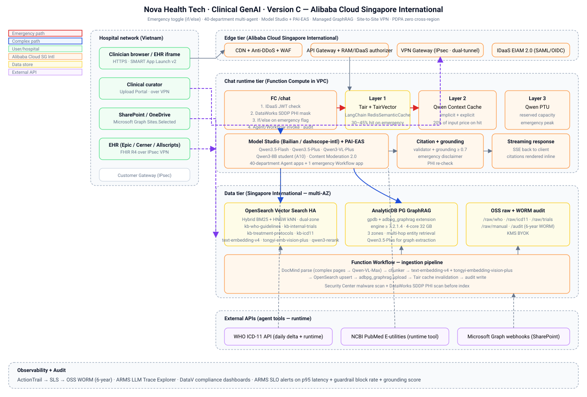
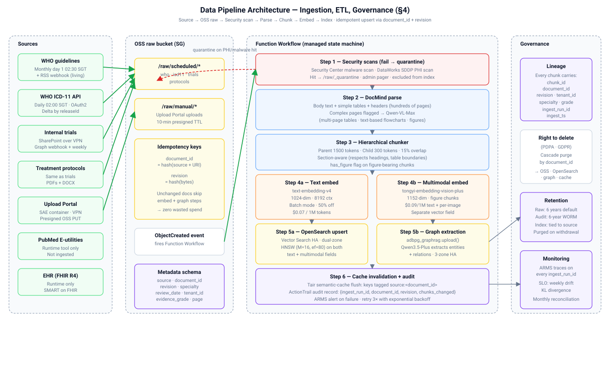
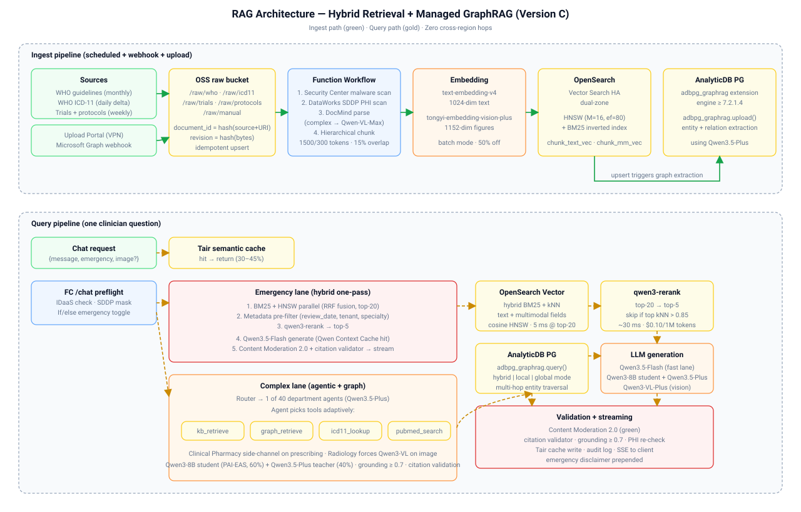
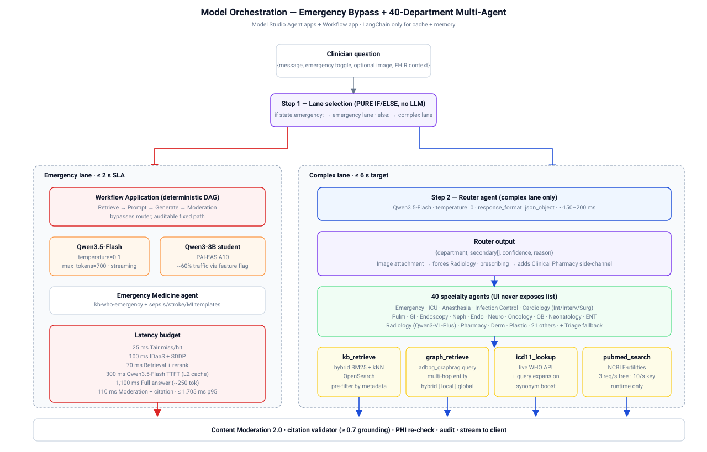
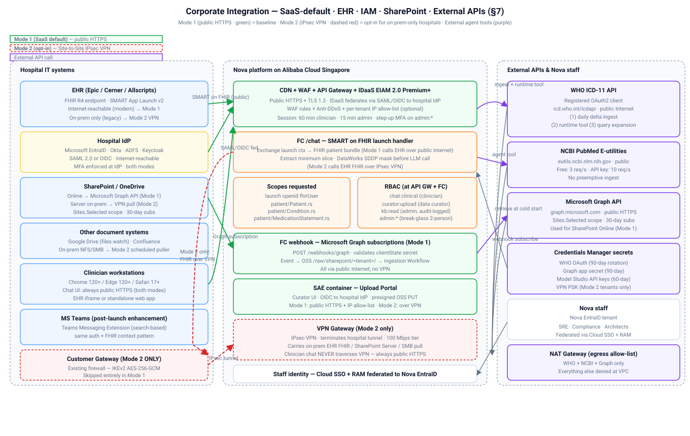
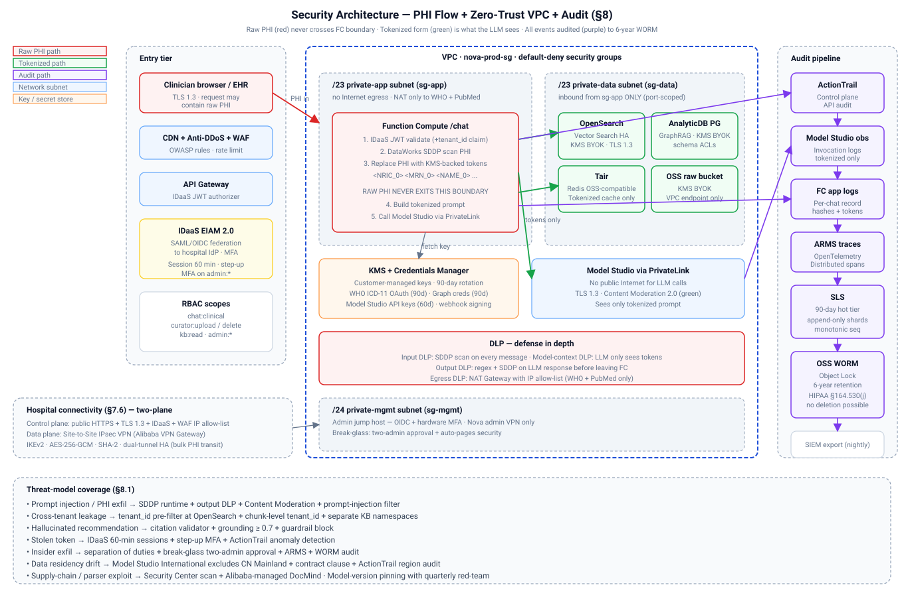
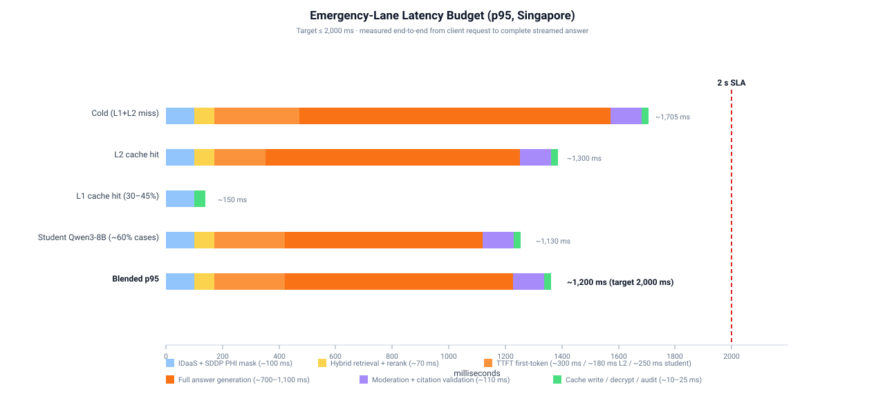
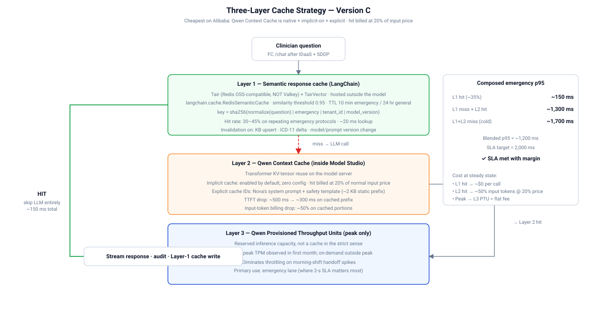

# Technical Architecture Proposal

**Nova Health Tech: GenAI Clinical Decision Support Assistant**
**Version: Alibaba Cloud + Qwen (Singapore)**

*Version 1.0 · May 2026*

---

## Table of Contents

1. [Executive Summary](#1-executive-summary)
2. [Requirements Analysis](#2-requirements-analysis)
3. [Solution Overview](#3-solution-overview)
4. [Data Pipeline Architecture](#4-data-pipeline-architecture)
5. [Knowledge Base & RAG Architecture](#5-knowledge-base--rag-architecture)
6. [Model Orchestration](#6-model-orchestration)
7. [Corporate Integration Architecture](#7-corporate-integration-architecture)
8. [Security Architecture](#8-security-architecture)
9. [Deployment Architecture](#9-deployment-architecture)
10. [Performance Optimization](#10-performance-optimization)
11. [Observability & Compliance Monitoring](#11-observability--compliance-monitoring)
12. [Use Case Walkthroughs](#12-use-case-walkthroughs)
13. [Risks & Mitigations](#13-risks--mitigations)
14. [Implementation Roadmap](#14-implementation-roadmap)
15. [Estimation Cost](#15-estimation-cost)
16. [Appendices](#16-appendices)

---

## 1. Executive Summary

### 1.1 Problem statement

Nova Health Tech's clinical decision-support tool cannot keep pace with physician needs on two fronts: speed and medical relevance. Clinicians need grounded answers in seconds during diagnosis, with a hard 2-second target for emergency cases. Internal clinical trial reports sit in legacy PDFs with inconsistent tagging. WHO publishes monthly protocol updates that must reach clinicians within 24 hours. Patient-sensitive data carries healthcare data protection obligations that vary by jurisdiction. The assistant must answer complex medical questions in natural language, ground every claim in internal trial reports plus WHO guidelines plus WHO ICD-11 plus PubMed, stay auditable, and hold consistent tone across forty clinical specialties. The board has approved building this as a GenAI assistant for internal clinical staff and hospital clients.

### 1.2 Proposed solution overview

Single-region SaaS on Alibaba Cloud Singapore. Components grouped by layer:

**Edge and access**

| Component | Purpose |
|---|---|
| CDN, Anti-DDoS, WAF | Public HTTPS edge with per-tenant IP allow-list |
| API Gateway | Request entry with RAM and IDaaS authorization |
| IDaaS EIAM 2.0 | SAML or OIDC federation to hospital IdP |
| VPN Gateway (IPsec) | Data-plane tunnel for bulk PHI transfer |

**AI and chat**

| Component | Purpose |
|---|---|
| Qwen3.5-Flash | Fast-lane chat for 2-second emergency SLA |
| Qwen3.5-Plus | Complex-lane reasoning and teacher model |
| Qwen3-VL-Plus | Vision specialist for Radiology images |
| Qwen3-8B student on PAI-EAS | Serves 60 percent of complex traffic |
| Model Studio Applications | Agent apps per department, Workflow for emergency |

**Retrieval and knowledge**

| Component | Purpose |
|---|---|
| OpenSearch Vector Search Edition | Hybrid BM25 plus kNN retrieval |
| AnalyticDB PG GraphRAG | Multi-hop knowledge graph queries |
| text-embedding-v4, tongyi-embedding-vision-plus | Text and multimodal embeddings |
| qwen3-rerank | Top-20 to top-5 relevance reranking |
| DocMind, Qwen-VL-Max | PDF parsing including tables and figures |

**Caching**

| Component | Purpose |
|---|---|
| Tair plus TairVector | Semantic response cache, Layer 1 |
| Qwen Context Cache | Prefix KV cache, Layer 2 |
| Qwen PTU | Reserved capacity for emergency peak, Layer 3 |

**Security and compliance**

| Component | Purpose |
|---|---|
| DataWorks SDDP | PHI detection and tokenization |
| Content Moderation 2.0 | Guardrails for jailbreak and misinformation |
| KMS plus Credentials Manager | Customer-managed keys, secret rotation |
| ActionTrail, SLS, OSS WORM | Audit pipeline with 6-year retention |

**Compute and operations**

| Component | Purpose |
|---|---|
| Function Compute 3.0 | Stateless chat request handler |
| Function Workflow | Ingestion orchestration |
| SAE | Upload Portal container |
| PAI DLC plus Model Gallery | Student model training |
| ARMS LLM Trace Explorer | Distributed tracing and SLO alerting |

### 1.3 A note on "Singapore International"

[Alibaba Cloud operates two consoles from one physical cloud](https://www.alibabacloud.com/help/en/general-reference/latest/alibaba-cloud-overview): the **Mainland China site** (`aliyun.com`, primarily serves PRC customers) and the **International site** (`alibabacloud.com`, everywhere else). Some services are only exposed through one site or the other, even when both physically could reach the Singapore (`ap-southeast-1`) region.

All tenants are registered on the **International site**. When this document says:

- **"Singapore"** or **"SG"**: refers to the `ap-southeast-1` region (same physical region in either site)
- **"Singapore International"** or **"SG Intl"**: specifically means "the `ap-southeast-1` region accessed through the International site". Used to call out services whose availability differs between sites. [Model Studio](https://www.alibabacloud.com/help/en/model-studio/what-is-model-studio), for example, is International-site only: its runtime endpoint is `https://dashscope-intl.aliyuncs.com/...` (the `-intl` suffix is the manifestation of this split)
- **"Chinese Mainland"** or **"CN Mainland"**: the China site (Beijing, Shanghai, etc.). Out of scope for all tenants. A few Qwen models (`qwen3-vl-embedding`, `qwen3-vl-rerank`, `gte-rerank-v2`) exist only on this site and are therefore unavailable to us: we work around them with the International-site alternatives

Read "SG Intl" as "Singapore region via Alibaba Cloud International site".

---

## 2. Requirements Analysis

### 2.1 Functional requirements

| ID | Requirement |
|---|---|
| F1 | Accept free-form natural-language medical questions from clinicians |
| F2 | Retrieve grounded context from WHO guidelines, internal trial reports, treatment protocols, WHO ICD-11, and (optionally) PubMed |
| F3 | Return answers with inline citations mapping to retrieved chunks |
| F4 | Support an explicit "Emergency" toggle that routes to a fast lane targeting ≤ 2-second p95 |
| F5 | Support image attachments (e.g. X-rays, clinical photos) routed to a vision-capable Radiology agent |
| F6 | Auto-invoke Clinical Pharmacy as a side-channel on prescribing questions |
| F7 | Ingest WHO monthly updates automatically, reflect them within 24 hours |
| F8 | Ingest internal PDFs (trial reports, protocols) from hospital SharePoint via webhook + weekly reconciliation, plus an internal upload portal for ad-hoc additions |
| F9 | Federate clinician access to each hospital's existing IdP (EntraID / Okta / ADFS) via SAML or OIDC |
| F10 | Launch embedded in EHR session via [SMART App Launch v2](http://docs.smarthealthit.org/) on FHIR R4 |
| F11 | Maintain conversation context across turns within a clinical session |
| F12 | Refuse or block out-of-policy content (PHI exfiltration attempts, self-diagnosis, dosing overrides, jailbreaks) |
| F13 | Log every interaction in immutable audit storage for 6 years |

### 2.2 Non-functional requirements

| Category | Requirement | Target |
|---|---|---|
| **Latency** | Emergency-lane p95 response | ≤ 2,000 ms |
| | Complex-lane p95 response | ≤ 6,000 ms |
| | Cached-hit response | ≤ 500 ms p95 |
| **Availability** | Monthly uptime | ≥ 99.9% |
| | RPO | ≤ 1 hour |
| | RTO | ≤ 4 hours |
| **Scalability** | Peak concurrent clinicians per tenant | 500 |
| | Peak queries per minute per tenant | 200 qpm |
| | Corpus size | 10,000+ documents, ~5M chunks |
| **Accuracy** | Holdout eval score vs clinician gold-standard | ≥ 95% |
| | PHI leakage in output | 0 tolerance |
| | Ungrounded-answer rate | ≤ 2% (blocked by guardrail) |
| **Tone** | Inter-rater agreement on "clinical tone" on 100-sample blind review | ≥ 80% |

### 2.3 Compliance & regulatory constraints

Alibaba Cloud holds industry-standard certifications relevant to clinical data hosting. Examples include PCI-DSS, ISO/IEC 27001, ISO/IEC 27017, ISO/IEC 27018, ISO/IEC 27701, SOC 1, SOC 2, SOC 3, and NIST 800-53 R5. Healthcare deployments should map their specific regulatory obligations to these certifications on a per-tenant basis.

Reference:
1. https://www.alibabacloud.com/en/trust-center

### 2.4 Assumptions and constraints

| Assumption |
|---|
| Hospitals accept Singapore-region deployment; no default cross-border replication |
| Clinicians access the assistant over public Internet (TLS 1.3, IDaaS JWT, WAF, per-tenant IP allow-list) or inside the EHR iframe (SMART App Launch v2) |
| Hospital EHR exposes an Internet-reachable FHIR R4 endpoint with SMART App Launch v2 (modern Epic, Cerner Millennium, Allscripts, Oracle Health deployments) |
| Hospital uses SharePoint Online (Microsoft Graph) or any other Internet-reachable document source (Google Drive, Confluence Cloud) |
| Hospital firewall allows outbound HTTPS to Nova's published IP range and domain for clinician traffic |
| Hospital firewall can terminate a Site-to-Site IPsec tunnel for the data pipeline (bulk PHI transfer: SharePoint Server, on-prem FHIR, SMB/NFS shares, Upload Portal) |
| WHO ICD-11 API rate limits are acceptable; Nova has a registered [OAuth2 client](https://icd.who.int/icdapi) |
| PubMed E-utilities free tier (3 req/s) is sufficient without an [API key](https://support.nlm.nih.gov/knowledgebase/article/KA-05317/en-us) for the agent-tool volume |
| Hospital IdP supports SAML 2.0 or OIDC |
| Medical-vocabulary allow-list for Content Moderation 2.0 is approved by Alibaba account team pre-launch |

**Constraint: no phases.** One production release activates every capability in this document. Training happens before cut-over. Post-launch runs continuous operations (monthly DPO, quarterly SFT), not phased feature rollouts.

---

## 3. Solution Overview

### 3.1 High-level architecture



ASCII equivalent (for text-only renderers):

```
              ┌──────────────────────────────────────────────────────────────┐
              │   Hospital network                                            │
              │   ├── Clinician workstations + EHR iframe                     │
              │   │     egress firewall whitelists:                           │
              │   │       • api.nova-health.sg (Nova API domain)              │
              │   │       • Nova published IP range (CDN + API Gateway)       │
              │   │                                                            │
              │   └── Backend data plane                                       │
              │         ├── On-prem EHR FHIR (if not Internet-reachable)      │
              │         ├── SharePoint Server / SMB / NFS trial shares        │
              │         └── Customer Gateway (IPsec endpoint)                 │
              └──┬──────────────────────────────────────────────┬────────────┘
                 │                                              │
   CONTROL PLANE │ HTTPS + IDaaS JWT             DATA PLANE     │ Site-to-Site
   (clinician    │ public Internet               (backend       │ IPsec VPN
    chat, EHR    │ TLS 1.3 + WAF + IP allow-list  PHI transfer, │ IKEv2
    iframe)      │                                SharePoint +  │ AES-256-GCM
                 │                                FHIR + uploads)│ dual-tunnel
                 ▼                                              ▼
     ┌──────────────────────────────────────────┐    ┌────────────────────────┐
     │ Nova edge: CDN + Anti-DDoS + WAF         │    │ VPN Gateway            │
     │  · per-tenant WAF IP allow-list          │    │  (private side of VPC)  │
     │  · OWASP + rate-limit rules              │    └───────────┬────────────┘
     └──────┬───────────────────────────────────┘                │
            │                                                    │
     ┌──────▼──────────┐                                         │
     │ API Gateway     │                                         │
     │  + RAM / IDaaS  │                                         │
     │    authorizer   │                                         │
     └──────┬──────────┘                                         ▼
            │                                    ┌───────────────────────────┐
            │                                    │ Private SLB + IDaaS        │
            │                                    │  OIDC/SAML ← hospital IdP  │
            │                                    │                            │
            │                                    │ SAE container:             │
            │                                    │  Upload Portal (over VPN)  │
            │                                    └───────────┬────────────────┘
            │                                                │
            ▼                                                ▼
   ┌──────────────────────────────┐            ┌──────────────────────────────┐
   │ Function Compute /chat (VPC) │            │ OSS raw bucket               │
   │  0. RAM/IDaaS token check    │◄─ sem cch─┤ /raw/scheduled/...           │
   │  1. PHI mask (DataWorks SDDP) │  hit ret   │ /raw/manual/...              │
   │  2. if/else on emergency      │  early     │ /raw/icd11/...               │
   │     toggle (pure, no LLM)     │            │ /raw/who/...                 │
   │  3. Model Studio Agent /      │            └──────────┬───────────────────┘
   │     Workflow app invoke       │                       │ ObjectCreated
   │  4. ground-check + audit      │                       ▼
   └─────┬──────────────┬──────────┘          ┌──────────────────────────────┐
         │              │                     │ Function Workflow             │
 Layer 1 │    Layer 2   │  Generation         │  DocMind parse to chunk to      │
 Tair    │    Qwen      │  (Model Studio +    │  embed to KB + graph sync      │
 +Tair   │    Context   │   PAI-EAS):         │                               │
 Vector  │    Cache     │   FAST LANE         │ + Security Center scan        │
 semantic│  (implicit + │     Qwen3.5-Flash   │ + SDDP PHI scan               │
 cache   │   explicit)  │   COMPLEX LANE      │                               │
         │              │     Qwen3.5-Plus    │                               │
         │              │       teacher (40%) │                               │
         │              │     Qwen3-8B student│                               │
         │              │       PAI-EAS (60%) │                               │
         │              │     Qwen3-VL-Plus   │                               │
         │              │       (Radiology)   │                               │
         │              │   ROUTER:           │                               │
         │              │     Qwen3.5-Flash   │                               │
         │              │       JSON mode     │                               │
         │              │   + Content Mod 2.0 │                               │
         │              │                     └──────────┬────────────────────┘
         │              │                                ▼
         │              │                ┌────────────────────────────┐
         │              │                │ Model Studio Knowledge Base│
         │              │                │  kb-who-guidelines         │
         │              │                │  kb-internal-trials        │
         │              │                │  kb-treatment-protocols    │
         │              │                │  kb-icd11                  │
         │              │                │  on OpenSearch Vector      │
         │              │                │  Search Edition (HA)       │
         │              │                ├────────────────────────────┤
         │              │                │ AnalyticDB PG GraphRAG     │
         │              │                │  (4-core 32GB, 3 zones)    │
         │              │                └────────────────────────────┘
         ▼              ▼
  All traffic to ActionTrail to SLS to OSS (WORM, 6-year retention)
```

### 3.2 Core architectural principles

1. **Stay in Singapore.** Every query-path service has a Singapore endpoint. Zero cross-region hops at runtime. Default posture: no cross-border transfer.
2. **Managed over self-managed.** Managed Model Studio, managed AnalyticDB PG GraphRAG, managed OpenSearch Vector Search HA, managed Tair. No Neo4j, no self-hosted vector store, no Kubernetes clusters the Nova team has to patch.
3. **Pure if/else for emergency routing.** Deterministic, no LLM call on the hot path. Saves ~300 ms.
4. **Every answer grounded + cited.** No un-cited output leaves the system. Guardrail blocks ungrounded output.
5. **Fine-tune cheaply, fine-tune often.** PAI SFT+LoRA ≈ $15–40 per run. Cheap iteration is the cheapest quality lever over 12+ months.
6. **PHI never reaches the model.** DataWorks SDDP masks before log write; FC tokenization reverses only in UI.
7. **Everything audited.** 6-year WORM retention covers common healthcare-data retention requirements in one policy.
8. **One product on day one.** No phase 1 / 2 / 3. Pre-launch build, launch, then continuous operations.

### 3.3 Technology stack summary

| Layer | Service | Purpose | Where |
|---|---|---|---|
| Edge | Alibaba CDN + Anti-DDoS + WAF | Public HTTPS edge protection | Global + SG |
| API entry | API Gateway | Request routing, authZ | SG |
| Compute (chat) | [Function Compute 3.0](https://www.alibabacloud.com/help/en/functioncompute/product-overview/overview) | Stateless chat handler | SG |
| Compute (background) | [Function Workflow](https://www.alibabacloud.com/help/en/functioncompute/developer-reference/function-workflow) | Ingestion orchestration | SG |
| LLM serving (API) | [Model Studio](https://www.alibabacloud.com/help/en/model-studio/what-is-model-studio) | Qwen chat and embedding API | SG Intl |
| LLM serving (custom) | [PAI-EAS](https://www.alibabacloud.com/help/en/pai) | Fine-tuned Qwen3-8B student inference | SG |
| LLM training | [PAI DLC + Model Gallery](https://www.alibabacloud.com/help/en/pai/use-cases/quick-start-deploy-fine-tune-and-evaluate-qwen3-models) | SFT, LoRA, DPO, GRPO runs | SG (Tokyo fallback) |
| Vector store | [OpenSearch Vector Search Edition](https://www.alibabacloud.com/help/en/open-search/vector-search-edition/product-overview) | Hybrid BM25 plus kNN | SG |
| Graph store | [AnalyticDB for PostgreSQL](https://www.alibabacloud.com/help/en/analyticdb/analyticdb-for-postgresql) + `adbpg_graphrag` | Multi-hop graph queries | SG (3 zones) |
| Cache L1 | [Tair](https://www.alibabacloud.com/product/tair) + [TairVector](https://www.alibabacloud.com/help/en/tair/user-guide/tairvector-overview) | Semantic response cache | SG |
| Cache L2 | [Qwen Context Cache](https://www.alibabacloud.com/help/en/model-studio/context-cache) | Prefix KV cache | SG Intl |
| Cache L3 | [Qwen PTU](https://www.alibabacloud.com/help/en/model-studio/model-training-and-deployment-billing) | Reserved peak capacity | SG Intl |
| Object storage | [OSS](https://www.alibabacloud.com/product/oss) | Raw corpus plus WORM audit | SG |
| PDF parsing | DocMind + Qwen-VL-Max | Legacy PDF extraction | SG Intl |
| Content safety | [Content Moderation 2.0](https://www.alibabacloud.com/product/content-moderation) | LLM input and output filter | SG |
| PHI handling | [DataWorks](https://www.alibabacloud.com/product/dataworks) + [SDDP](https://www.alibabacloud.com/product/sddp) | Detection and tokenization | SG |
| Identity (clinicians) | [IDaaS EIAM 2.0](https://www.alibabacloud.com/help/en/idaas/) Premium+ | Hospital IdP federation | SG |
| Identity (staff) | [Cloud SSO + RAM](https://www.alibabacloud.com/product/ram) | Nova EntraID federation | Global |
| Secrets | [KMS](https://www.alibabacloud.com/product/kms) + [Credentials Manager](https://www.alibabacloud.com/help/en/kms/user-guide/secrets-manager-overview) | Keys and rotating secrets | SG |
| Network | [VPC](https://www.alibabacloud.com/product/vpc) + [VPN Gateway IPsec](https://www.alibabacloud.com/help/en/vpn-gateway) + [PrivateLink](https://www.alibabacloud.com/product/privatelink) | Data-plane tunnel, service isolation | SG |
| Audit | [ActionTrail](https://www.alibabacloud.com/product/actiontrail) + [SLS](https://www.alibabacloud.com/product/log-service) + OSS WORM | 6-year immutable audit | SG |
| Observability | [ARMS LLM Trace Explorer](https://www.alibabacloud.com/help/en/arms/application-monitoring/user-guide/llm-trace-explorer) | OpenTelemetry traces, SLO alerts | SG |
| Orchestration framework | [Model Studio Agent + Workflow Applications](https://www.alibabacloud.com/help/en/model-studio/application-introduction) | Department agents, emergency DAG | SG Intl |
| Client framework | LangChain + LangGraph | Semantic cache, session memory | SG FC runtime |

---

## 4. Data Pipeline Architecture



### 4.1 Data sources

| Source | Access method | Volume | Freshness |
|---|---|---|---|
| Internal clinical trial reports | SharePoint Online (Graph webhook) or SharePoint Server / SMB (both over IPsec VPN, §7.6.2) | Hundreds per tenant | Weekly + webhook |
| Internal treatment protocols | Same as above | Dozens per tenant | Same |
| WHO guidelines | HTTP download; RSS webhook for living guidelines | ~300 corpus | Monthly + RSS |
| WHO ICD-11 API | Registered OAuth2 client | ~100k entities | Daily delta |
| PubMed E-utilities | Runtime agent tool | On-demand | Real-time |
| Manual upload (Upload Portal) | Internal portal over IPsec VPN; OIDC via hospital IdP | Ad-hoc | Immediate |
| EHR data (runtime only) | SMART App Launch v2 on FHIR R4 | Per session | Runtime fetch |

Provenance tracked via `document_id = hash(source + URI)` and `revision = hash(bytes)`.

### 4.2 Ingestion pipeline

```
[Source] to OSS /raw/<source>/<document_id>/<revision>.pdf
        to ObjectCreated to Function Workflow:
            Security Center malware scan
            DataWorks SDDP PHI scan (quarantine on hit)
            DocMind parse (complex pages to Qwen-VL-Max)
            Hierarchical chunker (1500/300 tokens, 15% overlap)
            text-embedding-v4 (text) + tongyi-embedding-vision-plus (figures)
            Upsert OpenSearch + adbpg_graphrag.upload
            Flush Tair cache tagged source:<document_id>
        to ActionTrail audit (immutable)
```

Idempotent on `document_id + revision`. Unchanged documents skip embed + graph steps.

### 4.3 Document parsing

Legacy PDFs contain body text plus horizontal and vertical tables, text-based flowcharts, and figures.

| Strategy | Usage |
|---|---|
| DocMind (managed parse) | Primary, all documents |
| Qwen-VL-Max | Complex pages flagged by DocMind (multi-page tables, flowcharts, figures) |
| Multimodal page-image embeddings via `tongyi-embedding-vision-plus` | Fallback for figure-heavy queries |

Chunks keep `source`, `page`, `section_heading` metadata. Figure-bearing chunks carry `has_figure=true` and dual text + multimodal embeddings.

### 4.4 Chunking, embedding, indexing

Chunking: hierarchical, section-aware. Parent 1500 tokens (passed to LLM), child 300 tokens (embedded + indexed), 15 percent overlap, respects section and table boundaries.

Embeddings:

| Use | Model | Dims | Price |
|---|---|---|---|
| Text chunks | `text-embedding-v4` | 1024 | $0.07 / 1M tokens |
| Figure-bearing chunks | `tongyi-embedding-vision-plus` | 1152 | $0.09 / 1M text + per-image |
| Rerank top-20 | `qwen3-rerank` | n/a | $0.10 / 1M tokens |

Indexing in [OpenSearch Vector Search Edition](https://www.alibabacloud.com/help/en/open-search/vector-search-edition/product-overview) HA dual-zone:

- HNSW on `chunk_text_vec` (1024 dim) and `chunk_mm_vec` (1152 dim)
- BM25 inverted index on raw text
- Metadata: `source`, `document_id`, `revision`, `document_type`, `publication_date`, `review_date`, `specialty`, `evidence_grade`, `page`, `section_heading`, `has_table`, `has_figure`, `tenant_id`

### 4.5 Refresh schedule

| Source | Cadence | Trigger |
|---|---|---|
| WHO ICD-11 API | Daily 02:00 SGT | CloudOps Scheduler cron |
| WHO guideline PDFs | Monthly day 1 02:30 SGT + RSS | Cron + API Gateway webhook |
| Internal trials, protocols | Weekly Sun 03:00 SGT + Graph subscription | Cron + API Gateway |
| Manual upload | Any time | Upload Portal over IPsec VPN |
| Full reconciliation | Monthly day 1 04:00 SGT | Cron |

Retry policy: 3 attempts with exponential backoff. Persistent failures page on-call.

### 4.6 Governance and lineage

Every chunk carries: `chunk_id`, `document_id`, `revision`, `source`, `publication_date`, `review_date`, `evidence_grade`, `specialty`, `tenant_id`, `ingest_ts`, `ingest_run_id`.

Lineage queries supported:

- Citation traceability: `document_id`, `page`, `revision`
- Historical interactions on a given chunk: query ActionTrail by `chunk_id`
- Cross-tenant isolation: `tenant_id` on every chunk; retrieval filter enforces it

Right to delete: removing a source document cascades to OpenSearch, the graph, and Tair.

Retention: raw documents 6 years by default. RAG index entries tied to document lifecycle.

---

## 5. Knowledge Base & RAG Architecture

### 5.1 RAG vs. fine-tuning decision rationale

Both are used for different purposes: RAG for factual grounding, fine-tuning for tone and latency.

| Need | Mechanism |
|---|---|
| Answer factual medical questions | RAG |
| 2-second emergency SLA | Qwen3.5-Flash on fast lane plus 3-layer cache |
| Consistent tone | SFT on Nova-approved answers, fixed system prompt, `temperature=0.1` |
| Tool-calling reliability | GRPO on open-weight Qwen, ad-hoc |

**Never train on PHI.** Training data is de-identified via DataWorks SDDP before any fine-tuning pipeline can read it.

### 5.2 Vector and graph stores



| Store | Service | Parameters |
|---|---|---|
| Vector | OpenSearch Vector Search HA, dual-zone | HNSW (M=16, efConstruction=200, efSearch=80); 1024-dim text + 1152-dim multimodal |
| Graph | AnalyticDB for PostgreSQL 7.0 (≥7.2.1.4) with `adbpg_graphrag` | 4-core 32 GB vector-optimized, 3 zones in SG |

Retrieval by lane:

```
Emergency lane:
  Tair semantic cache lookup
    hit: return cached answer
    miss: hybrid BM25 + kNN on OpenSearch (top 20, review_date >= NOW-18m)
          qwen3-rerank to top 5
          LLM generation

Complex lane:
  Tair cache lookup (low hit rate; content is novel)
  Model Studio Agent invokes tools:
    kb_retrieve      hybrid BM25 + kNN
    graph_retrieve   adbpg_graphrag.query, multi-hop
    icd11_lookup     live WHO API
    pubmed_search    live NCBI E-utilities
  Agent synthesizes with full tool trace for citation
```

### 5.3 Hybrid search

OpenSearch fuses BM25 and HNSW via Reciprocal Rank Fusion:

```
bm25_scores   = BM25 (weight 0.4)
vector_scores = HNSW on chunk_text_vec (weight 0.6, cosine)
fused_scores  = RRF(k=60)
top_k         = fused_scores.top(20)
reranked      = qwen3-rerank(query, top_k).top(5)
```

Pre-filters before ANN search: `review_date >= NOW - 18 months`, `tenant_id = <current-tenant>`, `specialty IN <router_output.secondary>`.

Query expansion: on a detected disease mention, `icd11_expand_query(term)` injects synonyms and ICD-11 codes into the BM25 query.

### 5.4 Citation traceability

Every answer includes inline `[n]` citations that map to retrieved chunks. A citation validator runs before the client response:

```python
def validate_citations(answer, retrieved_chunks):
    for cid in extract_citation_ids(answer):
        if cid not in [c.chunk_id for c in retrieved_chunks]:
            return False  # hallucinated citation
    return True
```

Fail action: block the response, log the attempt, return "I cannot answer this from the current context".

Citation payload in the UI:

```json
{
  "answer": "Stroke onset within 4.5 hours is eligible for IV thrombolysis [1] subject to contraindication screening [2].",
  "citations": [
    {"n": 1, "source": "WHO Acute Stroke Guideline 2025", "page": 42, "revision": "sha256:ab12..."},
    {"n": 2, "source": "Internal protocol CVA-002 v3", "page": 7, "revision": "sha256:cd34..."}
  ]
}
```

### 5.5 Freshness and versioning

| Timescale | Mechanism |
|---|---|
| Minutes | Tair cache invalidation on every successful upsert |
| Hours | Daily ICD-11 delta pull (02:00 SGT) |
| Days | Weekly SharePoint reconciliation; RSS webhook for living WHO updates |
| Months | Monthly WHO refresh, full reconciliation, DPO micro-run |
| Quarters | Full SFT + LoRA retrain |

Chunk revisions are hashed; new `revision` replaces old in place while audit log preserves which version was used. Model and prompt versions are pinned; a version bump flushes the semantic cache and triggers the eval harness.

---

## 6. Model Orchestration



### 6.1 Model lineup

| Role | Model | Notes |
|---|---|---|
| Emergency fast lane | Qwen3.5-Flash (1M context, streaming) | $0.10/1M in, $0.40/1M out; first-token ~300 ms with cache hit |
| Complex lane + teacher | Qwen3.5-Plus | $0.40/1M in, $2.40/1M out; 1M context, multimodal |
| Complex-lane student | Qwen3-8B on PAI-EAS | SFT + LoRA distilled from Qwen3.5-Plus; serves 60 percent of complex traffic; single A10 GPU |
| Vision specialist (Radiology) | Qwen3-VL-Plus | Router forces on `has_image=true` |
| Router | Qwen3.5-Flash (`response_format=json_object`) | Structured output, 150 to 200 ms p95 |
| Emergency DR fallback | Qwen3-8B student | Circuit-breaker path on Model Studio outage |

### 6.2 Fine-tuning

Techniques on PAI:

| Technique | Use |
|---|---|
| SFT + LoRA | Primary; teacher mimicry and Nova tone |
| DPO | Monthly micro-run on clinician preference pairs |
| GRPO | Ad-hoc; tool-calling regression recovery |

Hyperparameters:

```
LoRA rank 16, alpha 32, dropout 0.05
learning_rate 2e-4, epochs 3, warmup_ratio 0.03, bf16
batch_size 4 per device, grad_accum_steps 4
```

Hardware: single A10 on PAI DLC, 2 to 4 GPU-hours per run.

Training pipeline:

```
1. Seed prompts: de-identified clinician questions + teacher paraphrases of WHO/protocol chunks; target 10k to 30k
2. Teacher generation on Qwen3.5-Plus batch mode: (prompt, RAG context, answer) triples
3. Clinician review, ~15 percent sample: SFT dataset + DPO pairs
4. Train on PAI Model Gallery: LoRA adapter + merged model
5. Eval harness (Qwen3.5-Plus judge): accuracy, citation coverage, PHI leakage (must be 0), tone, emergency fit
6. Promote to PAI-EAS behind feature flag; gate on >= 95 percent of teacher; 5 percent canary for 72 hours
```

No PHI in training data. Fine-tuning carries tone and format, not facts.

### 6.3 System prompts

Each of the 40 department agents has its own system prompt with a shared structure:

```
You are the {DEPARTMENT} specialist.

ROLE: answer within {DEPARTMENT_SCOPE}; ground every claim in retrieved context; cite as [n]; defer to physician.
TONE: concise, unambiguous, clinically neutral.
FORMAT: direct answer; 1 to 4 cited bullets; closing caveat.
HARD RULES:
- Emergency lane: <= 200 words.
- Insufficient context: "I cannot answer this from the current context".
- Never output raw PHI; tokens like <NAME_0>, <MRN_0> are already redacted.
```

Emergency lane uses a stricter template (triage, immediate action, red-flags).

### 6.4 Orchestration framework

[Model Studio Applications](https://www.alibabacloud.com/help/en/model-studio/application-introduction):

| Application type | Use |
|---|---|
| Agent application | Conversational; LLM-driven tool selection. One per department (40 agents). |
| Workflow application | Deterministic DAG (retrieve, prompt, generate, moderation). Emergency lane. |

LangChain used only for the Layer-1 semantic response cache and per-session chat memory.

### 6.5 Response validation

Five gates between LLM output and the clinician:

1. Content Moderation 2.0 (`green` API): jailbreak, self-harm, hate, medical misinformation
2. Citation validator: every `[n]` maps to a retrieved chunk
3. Grounding score >= 0.7
4. Last-mile PHI filter (regex + ML) on MRN, NRIC/FIN, DOB, phone, email
5. Emergency disclaimer prepended on emergency-lane answers

Any gate fail is logged; patterns trigger pages.

### 6.6 Multi-turn context

```
session_id = sha256(clinician_id | tenant_id | patient_fhir_id | login_time)
```

Memory: last 6 turns in Tair with 20-min TTL. Turn 7+ summarized by Qwen3.5-Flash and prepended as a system note. Emergency toggle flip resets memory. No cross-session memory; prior clinician notes pulled from EHR FHIR `DocumentReference` at runtime.

---

## 7. Corporate Integration Architecture



### 7.1 EHR integration (HL7 FHIR, CDS Hooks)

Standard: HL7 FHIR R4 plus SMART App Launch v2. Works against Epic, Oracle Health/Cerner, and Allscripts FHIR endpoints.

Launch flow:

```
1. Clinician opens patient chart, clicks "Ask Nova"
2. EHR launches iframe with ?iss=<fhir-endpoint>&launch=<ctx>
3. SMART App Launch v2 authorization-code flow (PKCE, public client)
4. Access token carries patient context + scopes
5. FC /chat:
   a. Exchange launch ctx into FHIR patient bundle
   b. Extract minimum slice (data minimization)
   c. De-identify via DataWorks SDDP
   d. Build prompt: system + RAG context + tokenized patient slice
   e. Call Model Studio; grounded + cited answer
   f. Re-identify tokens in UI only; model never sees raw PHI
```

FHIR resources read, all read-and-search scopes (never write):

| Resource | Purpose |
|---|---|
| `Patient` | Demographics (tokenized before LLM) |
| `Condition` | Active and resolved diagnoses |
| `MedicationStatement`, `MedicationRequest` | Current meds, drug-interaction check |
| `AllergyIntolerance` | Emergency dosing |
| `Observation` | Vitals and recent labs |
| `Encounter` | Current visit context |
| `DocumentReference` | Recent notes, only on explicit request |

CDS Hooks: `patient-view` proactive-suggestion hook is a post-launch enhancement. The iframe launch covers initial scope.

### 7.2 Identity and Access Management

| Population | Mechanism |
|---|---|
| Clinicians (external) | IDaaS EIAM 2.0 Premium Plus federated via SAML 2.0 or OIDC to hospital IdP (EntraID, Okta, ADFS, Keycloak); MFA at IdP |
| Nova staff (internal) | Cloud SSO + RAM federated to Nova EntraID; 60-min sessions; hardware MFA for `admin:*` |

Authorization scopes (checked at API Gateway and re-checked in FC):

```
chat:clinical       POST /chat
kb:read             Admin-only; retrieve from KB via API
curator:upload      Upload via portal
curator:delete      Delete docs (admin only)
admin:configure     Change router / guardrail config
admin:evaluate      Run eval harness
```

Session timeouts: 60 min clinicians, 15 min admins. Step-up MFA on `admin:*` and living-guideline-override uploads. Break-glass: two named Nova admins with hardware MFA and second-admin approval; auto-pages security.

### 7.3 Clinical workflow embedding

| Surface | Integration |
|---|---|
| Epic / Cerner / Allscripts iframe | SMART App Launch v2 |
| Nova web app (standalone) | OIDC against hospital IdP; no EHR context unless FHIR endpoint configured |
| Microsoft Teams | Messaging Extension (search-based); post-launch enhancement |
| Mobile (iOS/Android) | Browser-first initially; native client on roadmap |

### 7.4 Document management integration

SharePoint / OneDrive via Microsoft Graph subscriptions with `Sites.Selected` scope:

```http
POST https://graph.microsoft.com/v1.0/subscriptions
{
  "changeType": "updated,created,deleted",
  "notificationUrl": "https://api.nova-health.sg/webhooks/graph",
  "lifecycleNotificationUrl": "https://api.nova-health.sg/webhooks/graph-lifecycle",
  "resource": "/sites/{site-id}/drives/{drive-id}/root",
  "expirationDateTime": "<30-days-from-now>",
  "clientState": "<random-secret-per-tenant>"
}
```

Subscriptions renew via lifecycle job. `clientState` validated on every notification. Event Hubs delivery option for high-traffic drives.

Other sources:

- Google Drive: `files.watch` push notifications
- Confluence Cloud: webhooks on `page_created` and `page_updated`
- On-prem NFS / SMB: scheduled puller (SAE container) over Site-to-Site VPN

### 7.5 External APIs

| API | Purpose | Integration |
|---|---|---|
| WHO ICD-11 | Daily snapshot to OSS, runtime `icd11_lookup`, query expansion | Registered OAuth2 client; credentials in Credentials Manager, 90-day rotation |
| PubMed E-utilities | Agent tool (runtime only) | Free tier 3 req/s, API-key tier 10 req/s |
| WHO guideline PDFs | Monthly + RSS ingest | HTTP download; no official API |

### 7.6 Hospital connectivity (two-plane model)

#### 7.6.1 Control plane: clinician traffic (public HTTPS)

Chat UI, EHR iframe, Upload Portal authentication all use public HTTPS.

| Control | Mechanism |
|---|---|
| Transport | TLS 1.3 via CDN and API Gateway |
| Authentication | IDaaS EIAM 2.0 Premium Plus federates to hospital IdP (SAML or OIDC); MFA at IdP |
| Authorization | JWT scopes checked at API Gateway and FC |
| Edge | Alibaba CDN, WAF, Anti-DDoS, per-tenant rate limits |
| Per-tenant WAF IP allow-list | Nova pins tenant access to hospital egress IP; hospital whitelists Nova IP and domain |
| PHI handling | DataWorks SDDP masks PHI to reversible KMS tokens before any model call |
| Audit | ActionTrail, SLS, OSS WORM (6 years) |

#### 7.6.2 Data plane: bulk PHI transfer (Site-to-Site IPsec VPN)

Backend flows carrying raw PHI in bulk (SharePoint, SMB, on-prem FHIR callback, Upload Portal) run over Site-to-Site IPsec VPN on [Alibaba VPN Gateway](https://www.alibabacloud.com/help/en/vpn-gateway).

| Attribute | Value |
|---|---|
| Product | VPN Gateway, IPsec-VPN feature |
| Tunnel type | Site-to-Site IPsec-VPN |
| Crypto | IKEv2, AES-256-GCM, SHA-2, PFS group 14 |
| HA | Dual-tunnel, BGP dynamic routing |
| Throughput | 5 to 1000 Mbps (resizable); baseline 100 Mbps per tenant |
| Transport | Public Internet (encrypted) |
| SLA | 99.95 percent |

Hospital side: existing firewall as Customer Gateway (Cisco ASA, Juniper SRX, Fortinet, Palo Alto, Huawei, H3C, strongSwan, vyOS). Hospital supplies static public IP, pre-shared key, subnet CIDR.

Connection setup:

```
1. Nova provisions VPN Gateway in SG VPC (2 public IPs, dual-tunnel)
2. PSK generated, stored in Credentials Manager (90-day rotation)
3. PSK shared via PGP-encrypted envelope
4. Hospital configures Phase 1 (IKEv2, AES-256-GCM, SHA-2, DH 14) and Phase 2 (ESP, PFS 14)
5. Tunnels establish, BGP brings up routes
6. Smoke test
```

Baseline cost: ~$110–150 per tenant per month.

#### 7.6.3 Turnkey alternative: [Smart Access Gateway (SAG)](https://www.alibabacloud.com/product/smart-access-gateway)

Hardware appliance (SAG-100WM or SAG-1000) plugs into hospital LAN and auto-establishes a pre-configured tunnel. ~$50–150/mo rental. For clinics without a dedicated network team.

#### 7.6.4 Not used

| Service | Note |
|---|---|
| [Apsara Stack](https://www.alibabacloud.com/product/apsara-stack) | On-prem; contract-only |
| [Express Connect](https://www.alibabacloud.com/product/express-connect) | $1,500–5,000+/mo; no material latency gain vs VPN |
| SSL-VPN (client-level) | Clinician access uses IDaaS federation instead |
| VPN for clinician chat | Public HTTPS plus IDaaS plus WAF is the control |
| [Cloud Enterprise Network (CEN)](https://www.alibabacloud.com/product/cen) | Not baseline; path prepared for future DR |

---

## 8. Security Architecture



### 8.1 Threat model

| Threat | Mitigation |
|---|---|
| PHI exfiltration via prompt injection | DataWorks SDDP masks PHI before prompt build; Content Moderation 2.0; prompt-injection filter; model never sees raw PHI |
| Hallucinated clinical recommendation | Citation validator blocks un-grounded output; grounding >= 0.7 |
| Cross-tenant data leakage | `tenant_id` pre-filter on every retrieval; separate KB namespaces; chunk-level `tenant_id` |
| Stolen API token | 60-min session timeout; IDaaS step-up MFA; ActionTrail anomaly detection |
| Model weight theft | IDaaS + RAM role-gating; VPC-private PAI-EAS endpoint |
| WHO ICD-11 OAuth client compromise | Credentials Manager 90-day rotation; KMS-encrypted; never in Git |
| Denial-of-service on emergency lane | Anti-DDoS + WAF; Qwen PTU reserved for peak; per-clinician rate limit |
| Supply-chain / parser exploit | Security Center scan on upload; DocMind is Alibaba-managed |
| Insider exfiltration | Separation of duties; break-glass two-admin approval; ActionTrail + SLS |
| Data residency drift | Singapore International excludes CN Mainland compute; contract clause |

### 8.2 PHI de-identification

At ingest: DataWorks SDDP scans with healthcare PHI rule packs. Matches quarantine to `/raw/_quarantine/`, admin notification, document excluded from index.

At runtime: FC `/chat` preflight runs SDDP on inbound message and any EHR-derived patient slice. Detected PHI becomes reversible KMS tokens: `<NAME_0>`, `<MRN_0>`, `<DOB_0>`, `<PHONE_0>`, `<EMAIL_0>`, `<NRIC_0>`. LLM sees only tokens. Answer is de-tokenized in the UI only. Audit log stores the tokenized form.

Training data passes a second SDDP scan with a stricter ruleset. No PHI in training data.

### 8.3 Encryption

| Surface | Mechanism |
|---|---|
| Client to edge | TLS 1.3 (CDN + WAF) |
| Edge to API Gateway | TLS 1.3 |
| API Gateway to FC | TLS 1.3 over PrivateLink |
| FC to Model Studio | TLS 1.3 over PrivateLink |
| FC to OpenSearch, Tair, AnalyticDB PG | TLS 1.3 over VPC |
| OSS, OpenSearch, Tair, AnalyticDB PG at rest | KMS BYOK |
| Credentials Manager | KMS-encrypted, 90-day rotation |

Service-mesh internal traffic uses ASM mTLS where supported. Data under an old key version remains decryptable until explicit expunging.

### 8.4 Network zero-trust

Default-deny VPC security groups:

```
VPC nova-prod-sg
  /24 public subnet:     API Gateway, WAF, CDN egress
  /23 private-app:       FC /chat runtime
  /23 private-data:      OpenSearch, AnalyticDB PG, Tair
  /24 private-mgmt:      admin jump host (OIDC + MFA)

Security groups:
  sg-edge:  allow 443 from 0.0.0.0/0 (via WAF)
  sg-app:   allow 443 from sg-edge; no Internet egress
  sg-data:  allow 6379 (Tair), 5432 (AnalyticDB PG), 443 (OpenSearch) from sg-app ONLY
  sg-mgmt:  allow 22 from Nova admin VPN only, MFA-gated
  sg-vpn:   IPsec endpoints only
```

No public Internet egress from chat FC. LLM calls use PrivateLink. WHO and PubMed calls go through NAT Gateway with destination IP allow-list.

Principles: every API call carries an IDaaS-issued JWT; no shared long-lived credentials between services; resource ACLs at the data tier; admin actions require fresh MFA challenge.

### 8.5 Access control and secrets

| Role | Scopes |
|---|---|
| `clinician` | `chat:clinical` |
| `curator` | `chat:clinical`, `curator:upload` |
| `clinical-lead` | `chat:clinical`, `curator:upload`, `kb:read` |
| `nova-engineer` | `admin:configure`, `kb:read` (audit-logged, read-only) |
| `nova-sre` | `admin:configure` plus break-glass on `admin:*` |

Credentials Manager holds WHO OAuth (90-day rotation), Graph app credentials (90-day), Model Studio API keys (60-day), webhook signing keys. No secrets in Git. FC retrieves at cold-start via RAM role assumption, in-memory only.

### 8.6 Audit and non-repudiation

Pipeline: ActionTrail (control plane) + FC app logs + Model Studio observability to SLS to OSS WORM, 6-year retention.

Per-interaction record:

```json
{
  "ts": "2026-05-10T14:22:08.117Z",
  "tenant_id": "hospital-xyz",
  "user_id": "sha256(clinician-id)",
  "session_id": "sha256(...)",
  "question_hash": "sha256(tokenized-message)",
  "emergency_toggle": true,
  "route": "emergency.cardiology-internal",
  "retrieved_chunk_ids": ["chunk-abc", "chunk-def"],
  "tools_invoked": ["kb_retrieve", "icd11_lookup"],
  "model_version": "qwen3-flash-2025-02",
  "prompt_version": "emergency_v3.md@sha256:...",
  "guardrail_verdict": "pass",
  "grounding_score": 0.87,
  "citations": [{"n": 1, "chunk_id": "chunk-abc"}],
  "answer_hash": "sha256(tokenized-answer)",
  "latency_ms": 1642,
  "cache_hit": "layer2"
}
```

No raw PHI in audit logs, only hashes and tokenized stand-ins. Session decryption keys are destroyed at session end. OSS Object Lock is WORM; even Nova admins cannot delete. SLS uses append-only shards. Each record carries a monotonic sequence number per tenant.

### 8.7 DLP

Three layers: input (SDDP + Content Moderation 2.0), model-context (tokenization layer), output (regex + SDDP on LLM output before leaving FC).

Egress: OSS buckets deny public-read. NAT Gateway egress allow-lists only WHO and PubMed.

Optional tenant-enabled watermarking: invisible Unicode watermark encoding `session_id` hash for forensic attribution.

---

## 9. Deployment


### 9.1 Cloud deployment model

Public cloud only, single-region Singapore International. No hybrid, no on-prem, no Apsara Stack in baseline.

Hospital-side footprint: firewall WAF allow-list entry (clinician path) and IPsec VPN endpoint termination (data-plane). Nothing else Nova-specific runs inside the hospital.

**Hybrid fallback exists** for clients who contractually require on-prem:
- Apsara Stack mirrors the public Singapore region API surface; the architecture documented here would drop into Apsara Stack with minimal changes
### 9.2 Public cloud components (Alibaba Cloud Singapore International)

Tier view (full service list in §3.3):

```
Edge:          CDN + Anti-DDoS + WAF + API Gateway
Compute:       Function Compute (chat) + Function Workflow (ingest) + SAE (Upload Portal)
AI:            Model Studio + PAI-EAS (student) + PAI DLC (training)
Data:          OpenSearch Vector Search HA + AnalyticDB PG (adbpg_graphrag) + Tair + OSS
Identity:      IDaaS EIAM 2.0 (clinicians) + Cloud SSO + RAM (staff)
Security:      KMS + Credentials Manager + Content Moderation 2.0 + DataWorks SDDP + Security Center
Observability: ARMS LLM Trace Explorer + SLS + ActionTrail
Network:       VPC + VPN Gateway (IPsec) + PrivateLink
```

### 9.3 Containerization

Serverless-first. Kubernetes only on request.

| Workload | Runtime |
|---|---|
| Chat request handling | Function Compute 3.0 |
| Ingestion pipeline | Function Workflow |
| Upload Portal UI | SAE container |
| PAI training | PAI DLC managed jobs |
| PAI student serving | PAI-EAS (single A10) |

ACK cluster available as optional footprint on client contract.

### 9.4 CI/CD

Code CI/CD: GitHub Actions to Alibaba Cloud. Dev push to lint and tests to staging deploy to integration tests to manual approval to production deploy to smoke test.

Model CI/CD: PAI Model Gallery training to eval harness (Qwen3.5-Plus judge) to gate (>= 95 percent teacher) to PAI-EAS feature flag to 5 percent canary for 72 hours to full ramp. Previous version retained for 30-day rollback.

Prompt CI/CD: prompts in Git, referenced by hash in audit log. Production changes require PR review and eval-harness re-run.

### 9.5 Disaster recovery

| Component | DR | RPO | RTO |
|---|---|---|---|
| OSS raw bucket | Cross-zone replication in SG | 0 | 15 min |
| OSS WORM audit | Cross-zone replication in SG | 0 | 15 min |
| OpenSearch Vector Search | HA dual-zone | 5 min | 10 min |
| AnalyticDB PG | Multi-AZ in SG + daily snapshot | 1 hour | 30 min |
| Tair | Multi-AZ MAZ combo | Rebuilds from source on miss | 5 min |
| FC / API Gateway | Regional auto-failover | 0 | 1 min |
| Model Studio | Alibaba-managed HA | 0 | 1 min |
| PAI-EAS student endpoint | Single-A10, restart on failure | Stateless | 5 min |

Targets met: RPO <= 1 hour, RTO <= 4 hours. Cross-region warm standby is a roadmap item.

Runbooks in Git: incident-response, restore-opensearch, restore-analyticdb, model-rollback, cache-flush.

---

## 10. Performance Optimization



### 10.1 Latency budget (emergency, 2-second target)

Cold path, Layer-1 miss:

```
25 ms     Tair semantic cache miss
100 ms    IDaaS token + DataWorks SDDP PHI mask
70 ms     Hybrid retrieval + qwen3-rerank
300 ms    Qwen3.5-Flash first-token (Qwen Context Cache hit on system prefix)
1,100 ms  Qwen3.5-Flash full answer (250 tokens, streaming)
110 ms    Content Moderation 2.0 + citation validator
total     <= 1,705 ms p95
```

Tair semantic cache hit (30 to 45 percent of emergency queries):

```
25 ms     Tair hit
100 ms    IDaaS + SDDP
30 ms     Cache decrypt + citation rehydrate + audit
total     <= 155 ms p95
```

Complex-lane budget 6,000 ms allows multi-tool agent synthesis.

### 10.2 Caching strategy



| Layer | Mechanism | Key details |
|---|---|---|
| L1 Semantic response | LangChain `RedisSemanticCache` on Tair + TairVector | Key includes normalized question + emergency flag + tenant + model version; 0.95 cosine threshold; TTL 10 min emergency / 24 hr general; 30 to 45 percent hit rate |
| L2 Prefix KV | Qwen Context Cache | Implicit from day 1 (20 percent of input price on hits); explicit cache IDs for static prefix; drops TTFT ~500 to ~300 ms |
| L3 Reserved capacity | Qwen PTU | Sized to peak TPM in month 1; on-demand fallback outside peak |

Invalidation rules: KB upsert flushes `source:<document_id>` tags; ICD-11 delta flushes `source:icd11`; prompt or model version change triggers full flush.

### 10.3 Inference optimization

Model Studio inference is Alibaba-managed; we pick the model tier.

Fine-tuned Qwen3-8B on PAI-EAS:

| Parameter | Choice |
|---|---|
| GPU | A10 (24 GB VRAM); Qwen3-8B bf16 is ~16 GB |
| Quantization | bf16 initial; INT8 AWQ optional post-launch |
| Batching | Dynamic batching (max batch 8, max latency 50 ms) |
| Inference backend | vLLM (default); SGLang optional |

vLLM PagedAttention + Automatic Prefix Caching add a second Layer-2-equivalent cache on the self-hosted tier.

### 10.4 Auto-scaling

| Component | Scaling |
|---|---|
| CDN + WAF | Alibaba-managed |
| API Gateway | Serverless; auto-scale |
| Function Compute | 16 pre-provisioned warm for emergency; elastic for complex |
| Function Workflow (ingest) | Concurrency cap 50 |
| OpenSearch Vector Search | 2 OCU baseline, scale to 4 OCU for peak |
| AnalyticDB PG | 4-core 32 GB; vertical-scale to 8-core for peak |
| Tair | 1 GB baseline; shard as keys grow |
| Model Studio | On-demand; Qwen PTU on emergency peak |
| PAI-EAS | Single A10 baseline; scale to 2 at peak (session-affinity) |

Load shedding: if emergency p95 exceeds 1,800 ms sustained 5 min, non-emergency traffic gets a retry banner. Per-clinician rate limit 30 qpm with 1.5× burst; WAF returns 429 beyond that.

### 10.5 Retrieval optimization

HNSW parameters (5M-chunk corpus): M=16, efConstruction=200, efSearch=80. Gives ~95 percent recall@20 at ~5 ms per query.

Rerank: top-20 kNN from OpenSearch, qwen3-rerank scores to top-5. Adds ~30 ms and ~$0.0001 per query. Emergency lane skips rerank if top kNN score > 0.85 cosine. Complex lane always reranks.

Query-embedding latency: `text-embedding-v4` is ~20 ms for a 20 to 100 token query.

---

## 11. Observability & Compliance Monitoring

### 11.1 Logging, metrics, and tracing stack

| Signal | Tool | Retention |
|---|---|---|
| Control-plane API calls | [ActionTrail](https://www.alibabacloud.com/product/actiontrail) to SLS to OSS WORM | 6 years |
| Application logs (FC, SAE) | [SLS (Log Service)](https://www.alibabacloud.com/product/log-service) | 90 days hot + 6 years WORM archive |
| Model Studio + PAI-EAS serving logs | SLS | 90 days + 6 years WORM archive |
| Distributed traces | [ARMS LLM Trace Explorer](https://www.alibabacloud.com/help/en/arms/application-monitoring/user-guide/llm-trace-explorer) (OpenTelemetry) | 30 days |
| Metrics (CPU, latency, errors) | ARMS application monitoring | 30 days |
| Business metrics | SLS log store to [DataV dashboards](https://www.alibabacloud.com/product/datav) | 6 years |

Each trace span carries `tenant_id`, `session_id`, `route`, `emergency_flag`, `model_version`, `prompt_version`.

### 11.2 AI-specific monitoring (drift, hallucination rate, latency SLOs)

SLOs (alert on 5-minute window breach):

| Metric | Target | Alert threshold |
|---|---|---|
| Emergency-lane p95 latency | <= 2,000 ms | > 2,500 ms for 5 min |
| Complex-lane p95 latency | <= 6,000 ms | > 7,500 ms for 10 min |
| Guardrail block rate | < 3% | > 5% for 30 min |
| Citation validator fail rate | < 1% | > 2% for 30 min |
| Grounding score p50 | >= 0.82 | < 0.75 for 30 min |
| Model invocation 5xx error rate | < 0.1% | > 0.5% for 5 min |
| Layer-1 cache hit rate (emergency) | 30 to 45% | < 20% sustained |

Drift signals monitored weekly: embedding distribution (KL divergence vs baseline), answer-length p50, citation density per answer. Hallucinations: citation-validator failures logged to SLS; weekly sample of 100 answers goes to clinical reviewers; flags feed the monthly DPO retrain.

### 11.3 Clinical audit trail and explainability

Every interaction is end-to-end traceable. A clinical safety officer can answer:

| Question | Source field |
|---|---|
| Which guideline backed this answer? | `retrieved_chunk_ids` with source + page + revision |
| Which model + prompt produced it? | `model_version`, `prompt_version` hashes |
| What tools did the agent call? | `tools_invoked` trace |
| Was PHI involved and masked? | SDDP scan + tokenization flags in ActionTrail |
| Guardrail verdict and grounding? | `guardrail_verdict`, `grounding_score` |
| Has the cited guideline been superseded? | `chunk_id.revision` vs current revision |

UI explainability: inline `[n]` citations with source + page tooltip, "Why this answer?" expander showing retrieved chunks, and a "Model details" link showing family + version.

### 11.4 Regulatory reporting capabilities

Monthly automated reports to the hospital compliance officer: usage per specialty, guardrail incidents, data residency attestation (region per service), retention attestation (WORM status), access reviews with break-glass events, and model or prompt version history. On-demand exports: per-clinician query log, per-document usage log, and full forensic session replay. SLS audit logs ship nightly to the hospital SIEM (Splunk, Sentinel, QRadar) via cross-account role assumption.

---

## 12. Use Case Walkthroughs

Four scenarios drawn from the brief's required capabilities, each showing the architecture end-to-end.

### 12.1 Emergency care query (2-second path)

Scenario: a night-shift cardiology resident sees a 40-year-old male with sudden crushing chest pain, opens Epic, clicks "Ask Nova" with the emergency toggle on.

Flow:
1. Request hits CDN, API Gateway, and Function Compute `/chat` with `emergency=true`.
2. IDaaS validates the token; DataWorks SDDP scans for PHI (none in this query).
3. Tair Layer-1 semantic cache lookup: miss.
4. Hybrid retrieval returns 5 chunks from `kb-cardio-internal` and `kb-who-guidelines`.
5. Qwen3.5-Flash streams the answer with Qwen Context Cache hit on the system prefix.
6. Content Moderation 2.0 and the citation validator pass; audit record written to SLS; cache stores the answer with a 10-minute TTL.

End-to-end p95: ~1,700 ms. A second clinician with a similar question 4 minutes later hits cache and sees the answer in ~150 ms.

### 12.2 WHO protocol update propagation

Scenario: WHO publishes a revised "Acute coronary syndromes initial management" guideline. The update must reach every clinician's next answer within 24 hours, prior cached answers must be invalidated, and the audit trail must preserve which clinicians saw which version.

Flow:
1. 02:30 SGT, CloudOps Scheduler fires the monthly WHO refresh workflow; FC diffs the publications index and detects one new revision.
2. New PDF lands in OSS `/raw/who/<document_id>/<revision>.pdf`; ObjectCreated event triggers ingestion.
3. Ingestion runs: Security Center malware scan, DataWorks SDDP (no PHI), DocMind parse with Qwen-VL-Max for figures, hierarchical chunker, `text-embedding-v4` + `tongyi-embedding-vision-plus`.
4. Idempotent upsert to OpenSearch Vector Search: 318 chunks unchanged, 24 new or changed; `adbpg_graphrag.upload` re-extracts entities and relations for the 24 chunks.
5. Tair cache flushes keys tagged `source:who-acs-2025`; ActionTrail logs the run; ARMS notifies the on-call.

Subsequent queries retrieve the new revision and cite it with the new hash. Auditors can query SLS for clinicians who received answers citing the prior revision between dates. Living guidelines (e.g. COVID-19 therapeutics) take an event-driven RSS path and index within 10 minutes of publication.

### 12.3 Internal clinical trial query with patient-sensitive data

Scenario: an oncology attending asks about cardiac events in a 2024 trastuzumab-deruxtecan trial with a specific patient's identifiers inline (NRIC, MRN, LVEF 48 percent).

Flow:
1. DataWorks SDDP runtime scan detects NRIC, MRN, and name; KMS-tokenizes them (e.g. `<NRIC_0>`, `<MRN_0>`, `<NAME_0>`). Age and clinical values are preserved. The session holds the decryption key only.
2. Router classifies to `oncology-chemo` with cardiology and pharmacy as secondaries.
3. The oncology agent fires `kb_retrieve` with a mandatory `tenant_id=hospital-xyz` filter plus `graph_retrieve` on the drug entity; Clinical Pharmacy runs a DDI side-channel.
4. Retrieval returns 4 chunks from internal trial NCT-0xxx plus a 2-hop graph path showing known cardiotoxicity.
5. Qwen3.5-Plus synthesizes using only the tokenized slice; Content Moderation and citation validator pass.
6. FC de-tokenizes `<NAME_0>` back to the real patient name for the UI only; the audit record stores tokenized hashes and PHI-type counts, never raw values.

What PHI never reaches: the LLM prompt, Model Studio logs, the audit log (raw), or Tair cache. Cross-tenant isolation: the `tenant_id` filter is enforced at the OpenSearch query layer and the agent cannot override it. Training-data safety: if later used as a fine-tune seed, the tokenized form is pulled and re-scanned with the stricter pre-training ruleset.

### 12.4 Routine diagnostic question with source citation

Scenario: an internal-medicine attending asks "first-line empiric antibiotic for community-acquired pneumonia in a previously healthy 45-year-old adult, outpatient treatment".

Cache-hit path (most common for routine queries): IDaaS validates the token, SDDP finds no PHI, Tair Layer-1 returns a semantically similar answer (0.97 similarity), citations rehydrate, audit logs `cache_hit=layer1`. End-to-end: ~220 ms.

Cache-miss path: router selects `infectious-disease` with `pulmonology` and `pharmacy` secondaries. `kb_retrieve` returns chunks from WHO "Pneumonia management in adults" 2025 and the internal 2025 antibiogram; `icd11_lookup` returns J15.9; pharmacy side-channel confirms no DDI. Qwen3.5-Plus generates the answer with three citations; validator resolves 3 of 3; stream ends at ~3,400 ms.

Citations render as hoverable chips: clicking `[1]` opens the WHO PDF at the cited page, `[2]` opens a gated preview of the internal antibiogram (scope-checked), `[3]` expands the pharmacy tool trace.

---

## 13. Risks & Mitigations

### 13.1 Technical risks

| Risk | Probability | Impact | Mitigation |
|---|---|---|---|
| AnalyticDB PG `adbpg_graphrag` extension unavailable on target minor version | Low | High | Verify minor >= 7.2.1.4 at deploy; avoid 7.3.0.0 and 7.3.1.0 |
| WHO ICD-11 API outage | Medium | Low | Daily snapshot KB is the fallback; `icd11_lookup` degrades with staleness banner |

### 13.2 Compliance risks

| Risk | Probability | Impact | Mitigation |
|---|---|---|---|
| Hospital cannot accept the selected residency zone | Medium | Varies | Hybrid to Apsara Stack offered; or pivot to an alternate Alibaba Intl region subject to tenant assessment |

### 13.3 Operational risks

| Risk | Probability | Impact | Mitigation |
|---|---|---|---|
| Clinician adoption outpaces quota | High | Medium | Over-provision Qwen PTU + OpenSearch OCU for first 30 days; weekly utilization review |
| Engineer accidentally deletes production state | Low | High | OSS WORM on audit; AnalyticDB PG + OpenSearch daily snapshots; two-admin approval for destructive ops |
| Key rotation fails and service drops | Low | High | Monthly rotation test; blue/green keys valid for 24 hr during rotation; alerting |
| On-call unreachable on SEV-1 | Low | High | Two-person rotation; escalation to Alibaba TAM within 15 min |
| Fine-tune run ingests bad training data | Medium | Medium | SDDP strict scan on training set; eval harness + 5% canary; 30-day prior-model retention |
| Cost spike from chatty agent loop | Medium | Low | FC budget alarm; agent max-steps cap at 8; dashboards alert on > 2x median per clinician |
| Breaking API change (WHO ICD-11, Microsoft Graph) | Low | Medium | Pinned SDK versions; integration tests; monthly canary request |
| Hospital IdP SAML metadata expires | Medium | Medium | Renewal tracker + 30-day pre-expiry notification |
| Departure of a key engineer | Medium | Medium | Runbooks in Git; pair rotations; quarterly game-days |

Residual risk after mitigation on every item is LOW or VERY LOW; nothing blocks go-live.

---

## 14. Implementation Roadmap

One product, no phases. Every capability is active on day one. The roadmap describes a pre-launch build window that finishes before cut-over, plus the continuous-operations cadence after.

### 14.1 Pre-launch build

Six- to ten-week window with parallel workstreams. Actual duration depends on the tenant's IdP and FHIR readiness.

| Workstream | Weeks | Key deliverables |
|---|---|---|
| Foundation | 1 to 2 | Tenant provisioned (VPC, KMS, IDaaS, subscriptions); OSS raw bucket with Object Lock; OpenSearch HA; AnalyticDB PG (engine >= 7.2.1.4); Tair; CloudOps Scheduler |
| Data pipeline + RAG | 1 to 4 | WHO monthly and ICD-11 daily ingestion live; DocMind + Qwen-VL-Max parsing; embed pass; OpenSearch hybrid index; `adbpg_graphrag.initialize` + `upload`; Upload Portal; Microsoft Graph webhooks on tenant SharePoint |
| Model + fine-tuning | 3 to 5 | Qwen3-8B student SFT + LoRA on PAI Model Gallery; optional DPO micro-run; eval harness (Qwen3.5-Plus judge on accuracy, citation, PHI, tone); PAI-EAS deploy behind feature flag |
| Orchestration + multi-agent | 3 to 6 | 40 Agent applications + 1 emergency Workflow; router prompt; 4 tools (`kb_retrieve`, `graph_retrieve`, `icd11_lookup`, `pubmed_search`); Radiology vision-force rule; Clinical Pharmacy side-channel |
| Clinical embedding + security | 5 to 7 | EHR integration (Epic, Cerner, Allscripts FHIR R4); IDaaS EIAM Premium+ federation to hospital IdP; data-pipeline IPsec VPN and Customer Gateway; SDDP medical-PHI rule pack; Content Moderation allow-list pre-approved; KMS BYOK keys rotated in |
| Performance + compliance | 6 to 9 | 200+ adversarial-prompt red-team; guardrail policy tightening; Qwen PTU sized to load-test peak; cache hit-rate tuning; DR game-day; audit-pipeline attestation (ActionTrail to SLS to OSS WORM 6-year) |
| Clinical pilot + cut-over | 9 to 10 | Read-only pilot with small clinician cohort; sign-off by clinical safety officer + compliance officer; full production cut-over; Nova on-call activated |

Launch gate (all must be green): emergency p95 <= 2,000 ms on a 10,000-query load test; complex p95 <= 6,000 ms; guardrail block rate < 3% on the red-team set; zero PHI leaks in 500-sample output audit; grounding p50 >= 0.82 on eval-harness holdout; student model >= 95% of teacher on clinical-question holdout; all runbooks rehearsed; tenant sign-off.

### 14.2 Continuous operations (post-launch)

| Cadence | Activity |
|---|---|
| Real-time | SLO monitoring (§11.2); on-call pager on breach; WAF + Anti-DDoS + rate-limit |
| Hourly | Ingestion health check; failed webhooks re-queued |
| Daily 02:00 SGT | WHO ICD-11 delta ingest; Tair invalidates `source:icd11` |
| Weekly | SharePoint reconciliation; embedding-drift KL-divergence check |
| Monthly day 1 02:30 SGT | WHO guideline PDF refresh; incremental `adbpg_graphrag.upload`; living-guideline RSS catch-up |
| Monthly | DPO micro-run on clinician preference pairs; 5% canary before promotion |
| Monthly | Compliance reports to tenant; access and break-glass audit |
| Quarterly | Full Qwen3-8B student retrain; 5% canary 72 hours before ramp; red-team re-run; DR game-day; cost right-size review |
| Event-driven | Retrain student on adversarial examples after guardrail incidents; emergency rollback on regression |
| Annually | Third-party penetration test; compliance recertification; clinical-safety review |

### 14.3 Milestone dependencies

Foundation precedes all other workstreams. Data pipeline must precede model fine-tuning (teacher needs grounded context to generate training data). Orchestration depends on both. Clinical embedding depends on the tenant's FHIR and IdP readiness and is usually the critical path. Performance and compliance tuning starts once end-to-end chat works in staging (around week 5 to 6).

### 14.4 Go / no-go gates

Mid-build (~week 5): end-to-end chat in staging against real data, 40 agents routable. If slipped > 2 weeks, replan.
Pre-launch (~week 9): launch-gate criteria met; clinical safety officer sign-off. Any red criterion is fixed before production traffic.

### 14.5 Team structure

| Function | Owner |
|---|---|
| Product and clinical decisions | Nova product owner + hospital clinical lead |
| Clinical accuracy and safety | Hospital safety officer + Nova clinical lead |
| Architecture | Nova architect |
| Day-to-day ops and on-call | Nova SRE (2 engineers on rotation) |
| Compliance reporting | Nova compliance lead |
| Incident response | SRE on-call + architect + clinical-safety backup |
| Vendor management (Alibaba TAM) | Nova architect + TAM |
| EHR integration per tenant | Nova integrations engineer |

### 14.6 Roll-back strategy

| Change type | Mechanism | Window |
|---|---|---|
| Code | Previous Git SHA re-deployed via CI/CD | ~10 min |
| Prompt | Previous prompt version re-referenced; Tair full flush | ~5 min |
| Model | PAI-EAS keeps 30-day prior version; flip feature flag | ~2 min |
| Index | OpenSearch idempotent upsert of prior revision | ~15 min per WHO doc |
| Graph | `adbpg_graphrag` re-ingest of prior revision hash | ~5 min per document |
| Guardrail policy | Version-controlled revert via PR + deploy | ~10 min |

SEV-1 rollbacks are SRE-led, architect notified after. SEV-2+ rollbacks require architect + clinical-safety sign-off.

---

## 15. Estimation Cost

Assumptions: 500 physicians, 40 queries per day, 30/70 emergency to complex split, 3,000 input + 350 output tokens emergency, 3,000 + 600 complex. All list prices, USD, early 2026.

| Item | Calculation | Monthly cost |
|---|---|---|
| Fast lane, Qwen3.5-Flash | 180k calls post L1 cache | 47 |
| Complex lane, Qwen3.5-Plus (40 percent of complex) | 420k calls at 40 percent | 440 |
| PAI-EAS A10 always-on (student, 60 percent of complex) | 720 hr at 1.00 to 2.00/hr | 720 to 1,500 |
| SFT plus LoRA training amortized quarterly | 15 to 40 per run, divided by 3 | 5 to 15 |
| text-embedding-v4 | 500M tokens at 0.07/1M | 35 |
| tongyi-embedding-vision-plus | 5M text tokens plus per-image | 50 |
| qwen3-rerank | 500M tokens amortized | 50 |
| Content Moderation 2.0 | Per call | 50 |
| OpenSearch Vector Search HA | Small cluster | 180 |
| AnalyticDB PG GraphRAG (4-core 32 GB) | Baseline plus extraction tokens | 300 |
| DataWorks SDDP | Per document plus runtime | 120 |
| Function Compute plus API Gateway plus CDN plus WAF | Serverless | 90 |
| OSS plus ActionTrail plus SLS WORM | 6-year retention | 70 |
| Tair (Redis OSS-compatible) | Clustered | 60 |
| IPsec VPN Gateway (data plane) | 100 Mbps, per tenant | 110 to 150 |
| **Launch-day monthly total** | | **2,280 to 3,060** |

Per-call:

| Call class | Cost (USD) |
|---|---|
| Emergency, Qwen3.5-Flash with L2 cache hit | 0.0008 |
| Emergency, Qwen3-8B student amortized | 0.0003 |
| Complex, Qwen3.5-Plus with L2 cache hit | 0.0026 |
| Vision, Qwen3-VL-Plus no cache | 0.004 |

Training runs:

| Item | Cost (USD) |
|---|---|
| Teacher dataset generation (Qwen3.5-Plus batch, 80M in + 6M out) | 23 |
| SFT plus LoRA training (2 to 4 GPU-hr A10) | 5 to 30 |
| Clinician review (in-house 15 percent sample) | 0 |
| Eval harness run (Qwen3.5-Plus judge) | 5 |
| **Per-run total** | **15 to 40** |

One-time pre-launch:

| Item | Cost (USD) |
|---|---|
| First student training run | 25 |
| Red team 200-prompt assessment | 100 |
| Load test to 200 qpm | 50 |
| DR game-day | negligible |
| **Subtotal** | **175** |

Reference:
1. https://www.alibabacloud.com/help/en/model-studio/model-pricing
2. https://www.alibabacloud.com/help/en/pai/use-cases/quick-start-deploy-fine-tune-and-evaluate-qwen3-models
3. https://www.alibabacloud.com/help/en/model-studio/context-cache
4. https://www.alibabacloud.com/help/en/model-studio/model-training-and-deployment-billing

---


## 16. Glossary

| Term | Meaning |
|---|---|
| **BM25** | Probabilistic keyword-ranking algorithm used alongside vector search for hybrid retrieval |
| **HNSW** | Hierarchical Navigable Small World: the ANN algorithm used for vector search |
| **KV cache** | Transformer key/value tensors reused across requests at Layer 2 |
| **LoRA** | Low-Rank Adaptation: efficient fine-tuning that updates only a small adapter |
| **SFT** | Supervised Fine-Tuning |
| **DPO** | Direct Preference Optimization |
| **GRPO** | Group Relative Policy Optimization (reinforcement fine-tuning with verifiable reward) |
| **PDPA** | Singapore Personal Data Protection Act |
| **HCSA** | Singapore Healthcare Services Act 2020 |
| **PHI** | Protected Health Information |
| **SDDP** | Alibaba's Sensitive Data Discovery and Protection service |
| **SLS** | Alibaba's Simple Log Service |
| **PTU** | Provisioned Throughput Unit (reserved inference capacity) |
| **Bailian** | OpenAPI product name for Model Studio |
| **DashScope** | Runtime API gateway for Model Studio |
| **SG Intl** | Shorthand for "Singapore region (`ap-southeast-1`) accessed through the Alibaba Cloud International site" (`alibabacloud.com`). Distinguishes from "SG on CN Mainland site" for services that differ by site: e.g. [Model Studio](https://www.alibabacloud.com/help/en/model-studio/what-is-model-studio) is International-only with runtime endpoint `dashscope-intl.aliyuncs.com`. See [§1.5](#15-a-note-on-singapore-international--sg-intl). |
| **International site** | `alibabacloud.com`: Alibaba's console for customers outside Mainland China. All tenants live here. |
| **CN Mainland site** | `aliyun.com`: Alibaba's console for Mainland China customers. Out of scope; hosts some Qwen variants (`qwen3-vl-embedding`, `qwen3-vl-rerank`, `gte-rerank-v2`) that are not available via International site. |
| **Tair** | Alibaba's Redis OSS-compatible managed service |
| **SAE** | Serverless App Engine (Alibaba's managed container runtime) |
| **WORM** | Write Once Read Many (immutable object storage) |
| **RAG** | Retrieval-Augmented Generation |
| **GraphRAG** | Knowledge-graph-augmented RAG for multi-hop reasoning |
| **FHIR** | Fast Healthcare Interoperability Resources (HL7 standard) |
| **SMART App Launch** | EHR-embedded app authorization standard |
| **CDS Hooks** | Clinical Decision Support trigger standard for EHR workflows |

### 16.E References

Primary sources cited inline throughout this document. Authoritative index:

- [Alibaba Cloud Model Studio: overview](https://www.alibabacloud.com/help/en/model-studio/what-is-model-studio)
- [Model Studio regions and pricing](https://www.alibabacloud.com/help/en/model-studio/regions/) · [Model pricing](https://www.alibabacloud.com/help/en/model-studio/model-pricing)
- [Agent vs Workflow Applications](https://www.alibabacloud.com/help/en/model-studio/application-introduction)
- [Qwen Context Cache](https://www.alibabacloud.com/help/en/model-studio/context-cache)
- [AnalyticDB PG: GraphRAG service](https://www.alibabacloud.com/help/en/analyticdb/analyticdb-for-postgresql/user-guide/use-the-graphrag-service)
- [PAI quick start: Qwen3 deploy / fine-tune / evaluate](https://www.alibabacloud.com/help/en/pai/use-cases/quick-start-deploy-fine-tune-and-evaluate-qwen3-models)
- [Tair (Redis OSS-compatible)](https://www.alibabacloud.com/product/tair)
- [OpenSearch Vector Search Edition](https://www.alibabacloud.com/help/en/open-search/vector-search-edition/product-overview)
- [Content Moderation 2.0 for Generative AI](https://www.alibabacloud.com/product/content-moderation)
- [IDaaS EIAM 2.0](https://www.alibabacloud.com/help/en/idaas/)
- [Alibaba Cloud Trust Center](https://www.alibabacloud.com/en/trust-center)
- [HIPAA §164.530(j) retention](https://www.law.cornell.edu/cfr/text/45/164.530)
- [Singapore PDPA cross-border transfer guidance](https://www.pdpc.gov.sg/organisations/resources/guidance-by-topic/guide-to-cross-border-data-transfers)
- [SMART App Launch v2](http://docs.smarthealthit.org/)
- [HL7 FHIR R4](https://www.hl7.org/fhir/R4/)
- [Microsoft Graph change notifications](https://learn.microsoft.com/en-us/graph/api/subscription-post-subscriptions?view=graph-rest-1.0)
- [WHO ICD-11 API](https://id.who.int/swagger/index.html)
- [NCBI E-utilities rate limits](https://www.ncbi.nlm.nih.gov/books/_about_eutils/efetch/#using-rate-limits)
- [Microsoft Research: GraphRAG on narrative private data](https://www.microsoft.com/en-us/research/blog/graphrag-unlocking-llm-discovery-on-narrative-private-data/)
- [MMedAgent-RL: multi-agent medical reasoning on Qwen2.5-VL](https://arxiv.org/html/2506.00555v2)
- [Agentic RAG: The 2026 Production Guide: MarsDevs](https://www.marsdevs.com/guides/agentic-rag-2026-guide)

*Content above is rephrased for compliance with licensing restrictions.*
